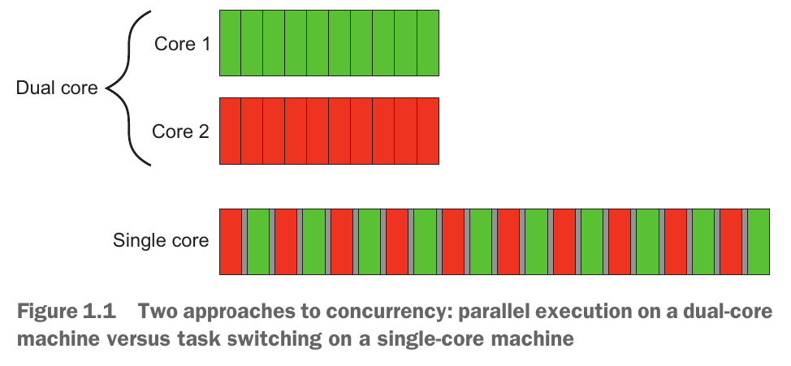
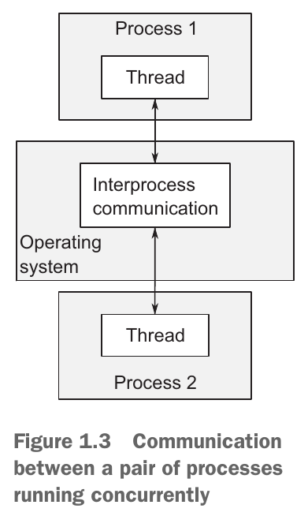

# Hello, world of concurrency in C++!

## The Outline
- What is concurrency?
    - Concurrency in computer systems
    - Approaches to concurrency
    - Concurrency vs. parallelism
- Why use concurrency?
    - Using concurrency for separation of concerns
    - Using concurrency for performance: task and data parallelism
    - When not to use concurrency
- Concurrency and multithreading in C++
    - History of multithreading in C++
    - Concurrency support in the C++11 standard
    - More support for concurrency and parallelism in C++14 and C++17
    - Efficiency in the C++ Thread Library
    - Platform-specific facilities
- Getting started
    - Hello, Concurrent World

## 什么是并发

### 计算机系统中的并发
"CCIA" 中对并发的解释：
> 简单来说，*并发* 就是指两个活动 (activity) 同时发生。在计算机系统中，并发是指单个系统并行执行多个独立的活动，而不是依次或一个接一个地执行。

并发的形式可以分为两种：
- 通过 *任务切换 (task switching)* 展现出来的并发 (the illusion of concurrency)
- 在多个处理器或多个处理核心上并行地运行任务 (hardware concurrency)

Wikipedia 上有对并发更细致的定义：
> 并发是指程序、算法或问题的不同部分或单元可以无序或部分顺序执行，而不会影响结果。这允许并行执行并发单元，从而可以显著提高多处理器和多核系统中的整体执行速度。用更专业的术语来说，并发性是指将程序、算法或问题分解为顺序无关或部分有序的组件或计算单元。

### 两种并发方法
#### 多进程
多进程并发，就好比是：你有一个项目需要开发，你给每个开发者都分配了一个独立的办公室，给每个人都分发了一本开发手册和工具，开发者们在开发过程中需要通过电话或者去其他开发者的办公室来进行沟通。

#### 多线程
多线程并发，就好比是：你有一个项目需要开发，你将开发者们集中在一个办公室里，大家可以共同查看一本开发手册和使用一些工具，开发者们在开发过程中直接面对面沟通即可。

