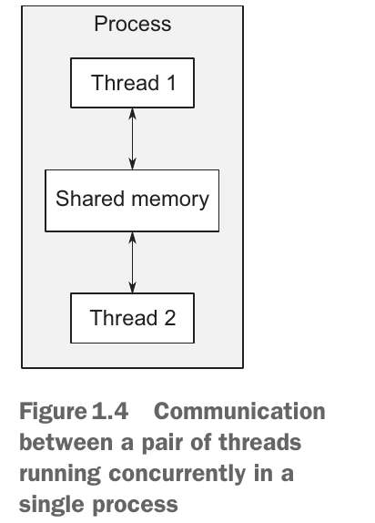

# Hello, world of concurrency in C++!

## The Outline
- What is concurrency?
    - Concurrency in computer systems
    - Approaches to concurrency
    - Concurrency vs. parallelism
- Why use concurrency?
    - Using concurrency for separation of concerns
    - Using concurrency for performance: task and data parallelism
    - When not to use concurrency
- Concurrency and multithreading in C++
    - History of multithreading in C++
    - Concurrency support in the C++11 standard
    - More support for concurrency and parallelism in C++14 and C++17
    - Efficiency in the C++ Thread Library
    - Platform-specific facilities
- Getting started
    - Hello, Concurrent World

## 什么是并发

### 计算机系统中的并发
"CCIA" 中对并发的解释：
> 简单来说，*并发* 就是指两个活动 (activity) 同时发生。在计算机系统中，并发是指单个系统并行执行多个独立的活动，而不是依次或一个接一个地执行。

并发的形式可以分为两种：
- 通过 *任务切换 (task switching)* 展现出来的并发 (the illusion of concurrency)
- 在多个处理器或多个处理核心上并行地运行任务 (hardware concurrency)


Wikipedia 上有对并发更细致的定义：
> 并发是指程序、算法或问题的不同部分或单元可以无序或部分顺序执行，而不会影响结果。这允许并行执行并发单元，从而可以显著提高多处理器和多核系统中的整体执行速度。用更专业的术语来说，并发性是指将程序、算法或问题分解为顺序无关或部分有序的组件或计算单元。

### 两种并发方法
#### 多进程
多进程并发，就好比是：你有一个项目需要开发，你给每个开发者都分配了一个独立的办公室，给每个人都分发了一本开发手册和工具，开发者们在开发过程中需要通过电话或者去其他开发者的办公室来进行沟通。每一个开发者就是一个进程，每一个独立的办公室、开发手册和工具就相当于给进程分配的资源，进程之间的资源被操作系统保护隔离开来，进程和进程之间需要通过 *进程间通信 (Inter-Process Communication, IPC)* 进行资源访问和协调工作。


使用多进程的优点：
- 操作系统为进程提供附加保护和高级别通信机制，相比于多线程编写的并发代码更加安全。
- 可以在通过网络连接的不同机器上运行单独的进程。

使用多进程的缺点：
- 进程间通信比较复杂或速度慢。
- 多进程的创建、切换和管理需要更多额外的开销（相比于多线程）。

#### 多线程
多线程并发，就好比是：你有一个项目需要开发，你将开发者们集中在一个办公室里，大家可以共同查看一本开发手册和使用一些工具，开发者们在开发过程中直接面对面沟通即可。线程类似于一种轻量化的进程，每一个线程可以独立的运行，并且不同的线程可能会以不同的顺序来执行指令。与进程不同的是，一个进程中的所有线程共享同一块地址空间，并且可以直接访问大部分数据。



因此，多线程的优点是：开销小，缺点是需要对共享资源进行保护。

#### C++ 对多进程和多线程的支持
C++ 对多进程并不提供内在支持，因此使用C++编写的多进程程序必须依赖特定于平台的API来实现。而 C++ 对多线程提供标准库支持，可以编写跨平台的多线程程序。

### 并发与并行

当人们主要关注的是利用可用硬件来提高批量数据处理的性能时，他们就会谈论并行性，而当人们主要关注的是关注点分离或响应能力时，他们就会谈论并发性。

## 为什么使用并发
- **分离关注点**
- **性能**

### 使用并发来分离关注点
例如开发一个音视频播放器，将用户交互界面与音视频解码分离，一个线程处理用户的请求，另一个进程负责读取文件解码音视频。

### 使用并发来提高性能
- 任务并行 (task parallelism)：将单个任务分解为多个部分，并行的运行它们。
- 数据并行 (data parallelism)：将一块数据分割成多个部分，并行地对每一部分进行同样的操作。

### 什么时候不使用并发
当并发带来的开销大于其收益的时候不使用并发。

## C++ 中的并发和多线程
C++ 从 c++11 标准开始支持多线程。在 Linux 平台上编译多线程程序需要带上 `-pthread` 选项。

## 开始入门

一个简单的多线程程序：
```cpp
#include <iostream>
#include <thread>

void hello() {
    std::cout << "Hello Concurrent World\n";
}

int main() {
    std::thread t(hello);  // 创建新线程
    t.join();  // 等待新线程汇入主线程
}
```