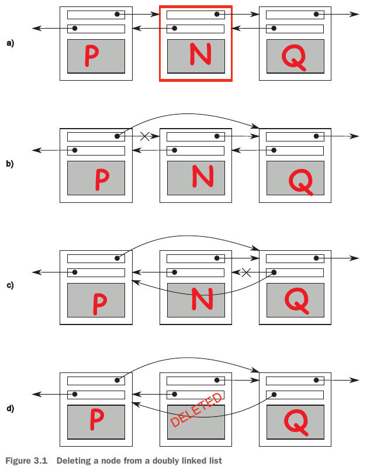

# Sharing Data between Threads
## The Outline
- [Problems with sharing data between threads](#线程间共享数据所带来的问题)
    - [Race conditions](#竞态条件)
    - [Avoiding problematic race conditions](#避免竞态条件)
- [Protecting shared data with mutexes](#使用互斥量保护共享数据)
    - [Using mutexes in C++](#在-c-中使用互斥量)
    - [Structuring code for protecting shared data](#组织代码来保护数据)
    - [Spotting race conditions inherent in interfaces](#发现接口中固有的竞争条件)
    - [Deadlock: the problem and a solution](#死锁问题和解决方案)
    - Further guidelines for avoiding deadlock
    - Flexible locking with `std::unique_lock`
    - Transferring mutex ownership between scopes
    - Locking at an appropriate granularity
- Alternative facilities for protecting shared data
    - Protecting shared data during initialization
    - Protecting rarely updated data structures
    - Recursive locking

## 线程间共享数据所带来的问题
当线程之间的共享数据是只读的话，是没问题的；但是，当一个或多个线程修改共享数据时就会产生问题。一个被广泛用于帮助程序员推理代码的概念是不变量 (invariants)：关于特定数据结构始终正确的语句。修改线程之间共享的数据时最简单的潜在问题是破坏不变量 (broken of invariants)。破坏不变量的后果是：一个线程可能读到了部分修改的数据；或者另一个线程试图修改数据时导致数据结构坍塌或程序崩溃。无论结果如何，这都是并发代码中最常见的错误原因之一：竞争条件 (race condition)。

看一个具体例子：从一个双向链表中删除一个节点

```cpp
template <typename T>
struct ListNode {
    ListNode *next, *prev;
    T data;
};
```



从一个双向链表中删除一个节点的步骤是：
- a. 定位到要删除的那个节点：N
- b. 更新 N 的前一个节点 (P) 的 next 指针，将其指向 N 的后一个节点 (Q)
- c. 更新 N 的后一个节点 (Q) 的 prev 指针，将其指向 N 的前一个节点 (P)
- d. 删除节点 N

其中，从步骤 b 到步骤 c 就会破坏不变量：在两个步骤之间，**P 的后一个节点是 Q，但 Q 的前一个节点却是 N**，这种不一致性就代表着不变量的破坏。如果此时另一个线程访问到了 P Q N 这三个节点，就会造成某些问题。比如，如果线程从前往后访问链表就会跳过节点 N，如果线程从后往前访问链表就不会跳过节点N；如果 Q 是链表的最后一个节点，另一个线程此时想删除它，这个线程会将 N 的 next 指针设为 `nullptr`，而 P 的 next 指针依然指向将要删除的节点 Q，这就会导致链表结构坍塌、程序出错。

### 竞态条件
竞态条件 (race conditon) 又叫做竞争条件，也被称为竞争冒险 (race hazard)。在并发中，竞争条件是指结果依赖于两个或多个线程操作执行的相对顺序；线程争先执行各自的操作。大多数情况下，这种竞争是良性的，因为产出的结果是可接受的，只是相对顺序有些不同。比如，向一个队列中添加元素，通常情况下，哪个元素先被添加哪个元素后被添加，我们并不关心，只要最终这些元素都被添加进去了就行了；因为不变量没有被破坏。而当竞争条件导致不变量被破坏时，就会导致不好的问题，例如删除双向链表中的某个节点。因此，在并发中，提到竞态条件，通常是指产生问题的竞态条件 (problematic race condition)。这种竞态条件经常给程序造成 bug。

有问题的竞争条件通常发生在完成操作需要修改两个或更多不同的数据（例如示例中的两个节点指针）的情况下。由于操作必须访问两个单独的数据，因此必须在单独的指令中修改这些数据，并且当只有一个数据完成时，另一个线程可能会访问数据结构（此时的数据结构是部分修改的）。

竞态条件通常很难发现并且更难复现，因为发生的机会窗口很短。随着系统负载的增加，以及操作执行次数的增加，出现有问题的执行序列的可能性也会增加。竞态条件通常是 timing-sensitive (时序敏感？) 的，在 debug 模式下可能会消失，因为 bebuger 改变了程序执行的 timing (时序？)。

总而言之，竞态条件是编写多线程程序时的一个**痛苦之源**，在并发中需要花费大量时间和精力来避免竞态条件。

### 避免竞态条件
#### 提供保护机制
为数据提供保护机制，当不变量被破坏时，只有修改线程能看到中间状态，而其他访问线程要么是还没有开始操作、要么是已经操作完成了。

#### 原子操作
另一种选择是修改数据结构及其不变量的设计，以便将修改作为**一系列不可分割的更改**来完成，每个更改都保持了不变量。(这通常涉及到 *无锁编程* 和 *内存模型* )。

#### 事务
将对数据的修改看成一项事务 (transaction)，所需的一系列数据修改和读取存储在事务日志中，然后通过单个步骤提交。如果由于数据结构已被另一个线程修改而无法继续提交，则事务将重新启动。

## 使用互斥量保护共享数据
将访问数据结构的所有代码片段标记为互斥的 (mutually exclusive)，这样如果任何线程正在运行其中一个，则任何尝试访问该数据结构的其他线程都必须等到第一个线程完成。这样就能让其他线程（除了正在修改数据的那个线程之外的线程）看不到被破坏的不变量，从而避免竞态条件的产生。

提供这种数据保护机制之一的是同步原语：*互斥量 (mutex)* (源自 **mut**ual **ex**clusion)。当访问共享数据时，将与之相关的互斥量锁住，当结束访问后解锁。线程库会确保，当一个线程锁住了一个互斥量后，其他想要获取这个互斥量的锁的线程只能等待互斥量被解锁。

但是，互斥量不是万能的 (mutexes are not *silver bullet*)。使用互斥量时，需要组织代码来保护正确的数据、需要避免接口间的竞态条件、需要避免死锁、以及考虑锁的粒度。

### 在 C++ 中使用互斥量
在 C++ 中，可以通过类 `std::mutex` 来创建一个互斥量对象，调用其成员函数 `lock()` 来锁住互斥量，调用其成员函数 `unlock()` 来解锁互斥量。但是，一般不会直接这么用，因为编写代码时容易忘记解锁而导致一些问题。通常，会使用 `std::lock_guard` 来锁住互斥量：这个类为 mutex 实现了 RAII 机制，在构造函数中会对提供的互斥量进行加锁，然后当对象离开作用域时在析构函数中将互斥量解锁。下面是一个使用 `std::mutext` 和 `std::lock_guard` 的例子 (具体代码请见 [listing 3.1](../../src/ch03_sharing_data_between_threads/listing_3_1.cc))：

```cpp
#include <list>
#include <mutex>
#include <algorithm>

std::list<int> some_list;
std::mutex some_mtx;

void add_to_list(int new_value) {
    std::lock_guard<std::mutex> guard(some_mtx);
    some_list.push_back(new_value);
}

bool list_contains(int value_to_find) {
    std::lock_guard<std::mutex> guard(some_mtx);
    return std::find(some_list.begin(), some_list.end(), value_to_find) !=
           some_list.end();
}
```

上面的例子将需要保护的数据 (即一个 `std::list<int>`) 和互斥量都定义为全局变量，这样做没什么问题，但是不符合 OOP 的思想。通常，会将互斥量和需要保护的数据包装在一个类中 (作为私有成员)，将需要访问被保护数据的一些操作封装起来作为成员函数。如果该类的所有成员函数在访问任何其他数据成员之前锁住互斥量，并在完成后解锁，则可以很好地保护数据。

但是，这也不是万无一失的！如果其中一个成员函数返回指向受保护数据的指针或引用，那么所有成员函数以良好、有序的方式锁定互斥量就无关紧要了，因为这已经在保护罩上炸开了一个大洞。任何有权访问该指针或引用的代码现在都可以访问（并可能修改）受保护的数据，而无需锁定互斥量。因此，**使用互斥量来保护数据需要谨慎地设计良好的接口**！

### 组织代码来保护数据
使用互斥量来保护数据，并不是粗暴地将 `std::lock_guard` 扔进每一个成员函数那样简单；只要有一个 stray pointer/reference，一切保护都是白费。那么，是不是只要不把对被保护数据的指针或引用返回（传回）给调用者，就可以保证数据的安全性呢？答案依然是否定的！因为将对被保护数据的指针或引用传递给要调用的函数，也会让数据陷入危险。下面这个例子展示了这一点：

```cpp
class some_data {
public:
    void do_something() {}
private:
    int a;
    std::string b;
};

class data_wrapper {
public:
    template <typename Func>
    void process_data(Func func) {
        std::lock_guard<std::mutex> lck(mtx);
        func(data); // 将被保护的数据传递给用户提供的函数
    }
private:
    std::mutex mtx;
    some_data data;
};

some_data *unproteced;
void malicious_function(some_data &protected_data) {
    unproteced = &protected_data;
}

data_wrapper x;
void foo() {
    x.process_data(malicious_function);  // 传入有恶意的函数
    unproteced->do_something(); // 不受保护地去访问受保护的数据
}
```

造成上面这种问题出现的根本原因是：**没有保证所有访问共享数据的代码都是 mutually exclusive 的**。不幸的是，这种问题 C++ 标准库不能帮你解决，责任在于编写代码的程序员！因此，程序员应该遵循一条指南：*不要将指针和对受保护数据的引用传递到锁的范围之外，无论是从函数返回它们，将它们存储在外部可见的内存中，还是将它们作为参数传递给用户提供的函数！*

### 发现接口中固有的竞争条件
考虑数据结构 `stack`，除了构造函数和 `swap()`，还有这些接口：
- `push`：将一个新元素压入栈中
- `pop`：从栈中弹出一个元素
- `top`：获取栈顶元素
- `empty`：检查栈是否为空
- `size`：获取栈中保存的元素个数

```cpp
template <typename T, typename Container=std::deque<T> >
class stack {
public:
    explicit stack(const Container&);
    explicit stack(Container&& = Container());
    template <class Alloc> explicit stack(const Alloc&);
    template <class Alloc> stack(const Container&, const Alloc&);
    template <class Alloc> stack(Container&&, const Alloc&);
    template <class Alloc> stack(stack&&, const Alloc&);

    bool empty() const;
    size_t size() const;
    T& top();
    T const& top() const;
    void push(T const&);
    void push(T&&);
    void pop();
    void swap(stack&&);
};
```

`top` 接口会返回对栈顶元素的引用，为了保护数据，需要将改成返回栈顶元素的副本。但是，这仍然会有竞争条件出现的风险。这是接口本身的设计导致的固有的竞争条件。

#### 存在的问题
**(1) `top()` 和 `empty()` 之间的竞争**
```cpp
stack<int> s;
if (!s.empty()) { // 1
    int const value = s.top(); // 2
    s.pop(); // 3
    do_something(value);
}
```

| 线程 t1      | 线程 t2   |
|   :-:       |  :-:      |
| `s.empty()` |           |
|             | `s.pop()` |
| `s.top()`   |           |

在一个线程 t1 中，1 处的 `s.empty()` 返回 false；然后，在另一个线程 t2 中，由于调用 `s.pop()` 让栈空了；此时 t1 中调用 `s.top()` 就会出现问题。

**(2) `top()` 和 `pop()` 之间的竞争**
假设栈中至少有两个元素，且只有下面这两个线程，考虑如下执行序列：

| 线程 A      | 线程 B   |
|   :-:       |  :-:      |
| `if(!s.empty())` |                  |
|                  | `if(!s.empty())` |
| `int const value=s.top();` |        |
|        | `int const value=s.top();` |
| `s.pop();` |                        |
| `do_something(value);` | `s.pop();` |
|  | `do_something(value);`           |

线程 A 和线程 B 获取到的元素是同一个元素，本来应该是线程 A 和线程 B 各自处理不同的元素，但是现在两个线程处理的是用一个元素，而另一个需要被处理的元素漏掉了，而且永远从栈中消失了。

**(3) 将 `pop` 和 `top` 操作合并**
`pop()` 接口被设计成将栈顶元素从栈中弹出，并返回给调用者。问题在于将元素返回给调用者时，复制构造可能会抛出异常，这就导致调用方没有接受到元素，元素也从栈中消失了。

#### 解决方法
##### Option 1: 传入引用
传递一个变量的引用给 `pop`，在调用 `pop()` 时将弹出的值作为参数接收在该变量中。
```cpp
// iterface
void pop(T &ele);

stack s;
T e; // 创建一个对象来接受从栈中弹出的值
s.pop(e);
```
这种方法有一个不足：调用方需要在调用 `pop()` 之前创建一个栈中元素类型的实例。对于某些类型来说，这是不切实际的，因为构造实例在时间或资源方面非常昂贵。对于其他类型来说，这并不总是可行的，因为构造函数需要的参数在代码中此时不一定可用。最后，这种方法要求栈中所存储的类型是可赋值的，这是一个重要的限制：许多用户定义的类型不支持赋值。

##### Option 2: 要求不抛出异常的复制构造函数或移动构造函数
让栈只接受存储那些复制构造函数或移动构造函数不抛异常的类型。这样是安全的，但是局限性太大。

##### Option 3: 返回指向弹出元素的指针
返回指向弹出元素的指针，因为复制指针不会抛出异常，但是使用指针就意味着要管理分配给元素的内存，增加了额外的负担。可以使用智能指针 `shared_ptr` 来减轻管理内存的负担。

##### Option 5: 提供 Option 1 和 Option2/Option3

##### 一个线程安全栈的例子
```cpp
// Listing 3.4 An outline class definition for a thread-safe stack
#include <exception>
#include <memory>

struct empty_stack: std::exception {
    const char * what() const noexcept;
};

template<typename T>
class threadsafe_stack {
public:
    threadsafe_stack();
    threadsafe_stack(const threadsafe_stack&);
    threadsafe_stack &operator=(const threadsafe_stack &) = delete;
    void push(T new_value);
    std::shared_ptr<T> pop(); // option 3
    void pop(T& value); // option 1
    bool empty() const;
};
```

具体实现：请见[listing 3.5]()。

### 死锁：问题和解决方案
死锁描述的是两个或多个线程由于相互等待而永远被阻塞的情况。例如：一对线程中的每个线程都需要锁定一对互斥锁才能执行某些操作，并且每个线程都有一个互斥锁并正在等待另一个互斥锁；此时，两个线程都无法继续，因为它们都在等待对方释放其互斥锁。

通用的避免死锁的建议是：永远以相同的次序来锁住两个互斥量。但是，有些时候也会出问题。例如，当交换两个实例中的数据时，为了保证两个实例的数据正确交换，需要锁住分别保护这两个实例的互斥量。以一定的次序锁住这两个互斥量，当两个被交换的实例不同时，没什么问题发生，但是当交换的两个实例是同一个实例，则会造成死锁（因为同一个实例的互斥量不能被锁住两次，c++ 中的 `std::mutex` 是非递归的）。

**C++ 中提供函数 `std::lock`，它可以一次性锁住多个互斥量且没有死锁的风险。**

下面这个例子展示的是一个交换操作（具体代码请见[listing 3.6](../../src/ch03_sharing_data_between_threads/listing_3_6.cc)）：
```cpp
class some_big_object {};
void swap(some_big_object &lhs, some_big_object &rhs) {};

class X {
public:
    X(const some_big_object &sd) : some_detail(sd) {}
    friend void swap(X &lhs, X &rhs);
    friend std::ostream &operator<<(std::ostream &os, const X &x);

private:
    some_big_object some_detail;
    mutable std::mutex mtx;
};

void swap(X &lhs, X &rhs) {
    if (&lhs == &rhs) {
        return;
    }
    std::lock(lhs.mtx, rhs.mtx);                                  // 1
    std::lock_guard<std::mutex> lock_a(lhs.mtx, std::adopt_lock); // 2
    std::lock_guard<std::mutex> lock_b(rhs.mtx, std::adopt_lock); // 3
    swap(lhs.some_detail, rhs.some_detail);
}
```

在交换函数中，首先会判断两个对象是不是同一个对象，如果不是同一个才交换。1 处会同时锁住 `lhs` 的互斥量和 `rhs` 的互斥量，如果 `std::lock` 已经锁住了一个互斥量，然后尝试锁住另一个互斥量时抛出了异常，已经被锁住的那个互斥量就会释放锁，然后将异常传出 `std::lock`。`std::lock` 提供了 *all-or-nothing* 的语义，要么锁住所有的互斥量，要么一个都不锁住。2 和 3 处初始化 `std::lock_guard` 对象时，多了一个 `std::adopt_lock` 参数，这个参数的意思是告诉 `std::lock_guard`，传入的互斥量已经上锁了，你不用在尝试上锁了，你只需要取得现有锁的所有权就行。