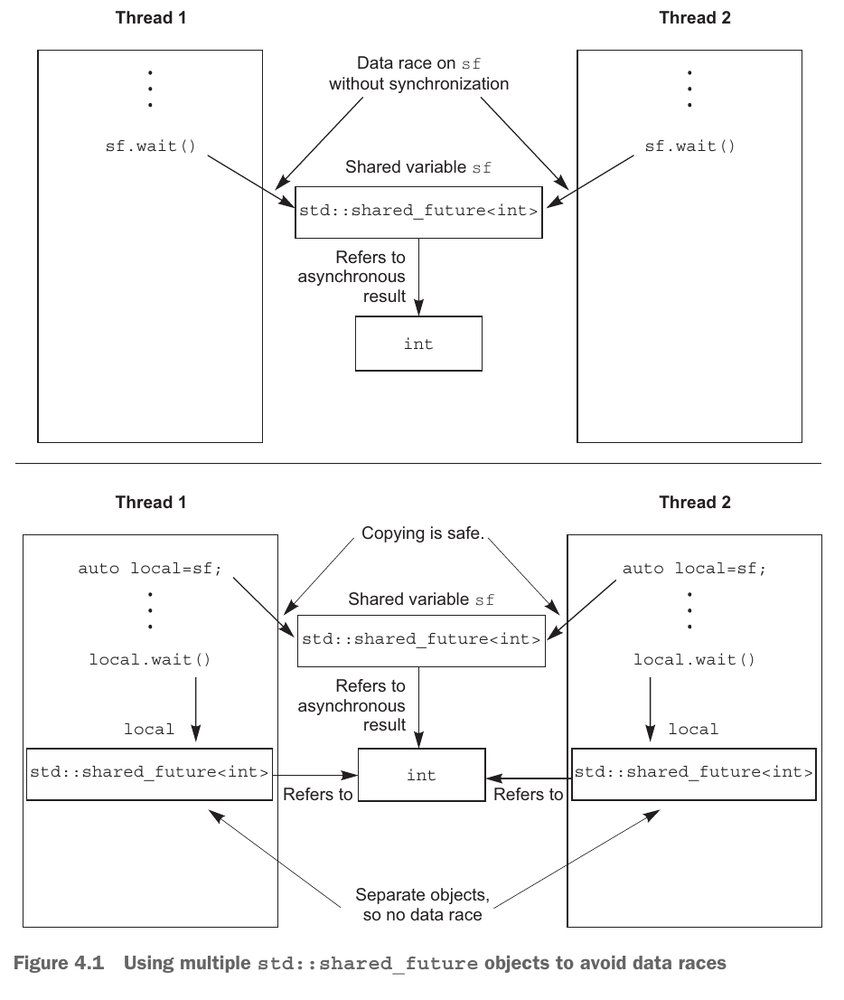

# Synchronizing Concurrent Operations

有时不仅需要保护数据，还需要**同步不同线程上的操作**。例如，一个线程可能需要等待另一个线程完成任务，然后才能开始完成自己的任务。通常，希望线程等待特定事件发生或条件成立是很常见的。虽然可以通过定期检查“任务完成”标志或存储在共享数据中的类似内容来实现这一点，但这并不是最佳的做法。像这样需要在线程之间同步操作的情况非常常见，C++ 标准库以 *条件变量 (condition variables)* 和 *futures* 的形式提供了处理该问题的工具。这些工具在并发技术规范 (Technical Specification, TS) 中进行了扩展，它为 futures 提供了更多操作，同时以 *latches* 和 *barriers* 的形式提供了新的同步工具。

# The Outline
- [Waiting for an event or other condition](#等待事件或其他条件)
    - [Waiting for a condition with condition variables](#使用条件变量等待条件)
    - [Building a thread-safe queue with condition variables](#使用条件变量构建线程安全队列)
- [Waiting for one-off events with futures](#使用-future-等待一次性事件)
    - [Returning values from background tasks](#从后台任务返回值)
    - [Associating a task with a future](#将任务与-future-关联)
    - [Making (std::)promises](#做出承诺stdpromise)
    - [Saving an exception for the future](#为-future-保存异常)
    - [Waiting from multiple threads](#从多个线程等待)
- [Waiting with a time limit](#有时间限制的等待)
    - [Clocks](#时钟)
    - Durations
    - Time points
    - Functions that accept timeouts
- Using synchronization of operations to simplify code
    - Functional programming with futures
    - Synchronizing operations with message passing
    - Continuation-style concurrency with the Concurrency TS
    - Chaining continuations
    - Waiting for more than one future
    - Waiting for the first future in a set with when_any
    - Latches and barriers in the Concurrency TS
    - A basic latch type: `std::experimental::latch`
    - `std::experimental::barrier`: a basic barrier
    - `std::experimental::flex_barrier` — `std::experimental::barrier`’s flexible friend

## 等待事件或其他条件
当一个线程等待另一个线程完成某项任务时，有这几种选择：

**选择 1**：
等待线程持续地检查共享数据中的完成标志（被 mutex 保护着），被等待的那个线程完成任务后设置标志。但这种做法是一种浪费：该线程消耗了宝贵的处理器时间来反复检查标志，并且当互斥锁被等待线程锁定时，它就不能被任何其他线程锁定。

**选择 2**：
在等待线程检查标志后，如果标志没有被设置，就释放锁让线程睡眠一段时间。这样做比第一种做法有提升，在线程睡眠的时间段不占用 CPU 时间，但是睡眠的时长无法掌控。睡的时间太短，还是会浪费处理器时间去做检查标志的工作；睡的时间太长，响应被等待线程就有延迟。
```cpp
bool flag;
std::mutex m;
void wait_for_flag() {
    std::unique_lock<std::mutex> lk(m);
    while (!flag) {
        lk.unlock(); // 解锁
        std::this_thread::sleep_for(std::chrono::milliseconds(100)); // 睡100毫秒
        lk.lock(); // 接着上锁，检查标志
    }
}
```

**选择 3**：使用 C++ 标准库提供的**条件变量 (condition variables)**。从概念上讲，条件变量与事件或其他条件相关联，并且一个或多个线程可以等待该条件得到满足。当线程确定条件得到满足时，它可以通知一个或多个等待条件变量的线程，以唤醒它们并允许它们继续处理。

### 使用条件变量等待条件
C++ 标准库提供两种条件变量：`std::condition_variable` 和 `std::condition_variable_any`。它们都需要和 mutex 配套使用才能提供合适的同步功能：`std::condition_variable` 仅适用于 `std::unique_lock<std::mutex>`，目的是为了性能最大化；而 `std::condition_variable_any` 适用于所有满足 *BasicLockable* 要求的对象，更加灵活，同时开销也更大一些。

一个使用条件变量的例子（具体代码请见 [listing 4.1](../../src/ch04_synchronizing_concurrent_operations/listing_4_1.cc)）：
```cpp
std::mutex mtx;
std::queue<data_chunk> data_queue;  // 1
std::condition_variable data_cond;

void data_preparation_thread() {
    while (more_data_to_prepare()) {
        const data_chunk data = prepare_data();
        {
            std::lock_guard<std::mutex> lk(mtx);
            data_queue.push(data);  // 2
        }
        // 这行代码在锁之外，当等待线程被通知唤醒后，不必再去等待锁。
        // 如果将这行代码移动到锁的作用范围内，等待线程被通知唤醒后，还需要等待
        // 这个线程这边释放锁
        data_cond.notify_one();  // 3 通知一个等待线程
    }
}

void data_processing_thread() {
    while (true) {
        std::unique_lock<std::mutex> lk(mtx);  // 4
        // `wait()` 接受一个 `std::unique_lock` 类型参数 和 一个 `Predicate` 类型参数
        // 这里提供的 `Predicate` 是一个 lambda funciton
        //
        // wait 会检查 `Predicate` 是否成立（lambda 函数返回 true）：
        //   - 成立的话就返回
        //   - 不成立的话就解锁 mutex，让线程阻塞
        //
        // 当被另一个线程通过 条件变量 通知后，此线程被唤醒
        // 先尝试获取锁，接着检查条件是否成立：
        //   - 获取不到锁，阻塞
        //   - 获取了锁，条件也成立，就返回
        //   - 获取了锁，条件不成立，解锁接着阻塞
        data_cond.wait(lk, [] { return !data_queue.empty(); });  // 5
        data_chunk data = data_queue.front();
        data_queue.pop();
        lk.unlock();  // 6
        process(data);
        if (is_last_chunk(data)) {
            break;
        }
    }
}
```

从根本上讲，`std::condition_variable::wait` 是对 *忙等待* 的优化。事实上，符合要求（尽管不太理想）的实现技术只是一个简单的循环：
```cpp
template <typename Predicate>
void minimal_wait(std::unique_lock<std::mutex> &lk, Predicate pred) {
    while (!pred()) {
        lk.unlock();
        lk.lock();
    }
}
```

### 使用条件变量构建线程安全队列
`std::queue` 的接口：
```cpp
template <class T, class Container = std::deque<T> >
class queue {
public:
    explicit queue(const Container&);
    explicit queue(Container&& = Container());
    template <class Alloc> explicit queue(const Alloc&);
    template <class Alloc> queue(const Container&, const Alloc&);
    template <class Alloc> queue(Container&&, const Alloc&);
    template <class Alloc> queue(queue&&, const Alloc&);
    void swap(queue& q);
    bool empty() const;
    size_type size() const;
    T& front();
    const T& front() const;
    T& back();
    const T& back() const;
    void push(const T& x);
    void push(T&& x);
    void pop();
    template <class... Args> void emplace(Args&&... args);
};
```

需要实现的 `threadsafe_queue` 的接口：
```cpp
template<typename T>
class threadsafe_queue {
public:
    threadsafe_queue();
    threadsafe_queue(const threadsafe_queue &);
    threadsafe_queue& operator=(const threadsafe_queue &) = delete;
    void push(T new_value);
    bool try_pop(T& value);
    std::shared_ptr<T> try_pop();
    void wait_and_pop(T& value);
    std::shared_ptr<T> wait_and_pop();
    bool empty() const;
}
```

完整的实现代码请见 [listing 4.5](../../src/ch04_synchronizing_concurrent_operations/listing_4_5.hpp)。

## 使用 `future` 等待一次性事件
如果等待线程只等待一次，那么当条件为真时，它将永远不会再等待此条件变量，条件变量可能不是同步机制的最佳选择。如果等待的条件是特定数据的可用性，则尤其如此。在这种情况下，`future` 可能更合适。

C++ 标准库使用一种称为 `future` 的东西来建模这种一次性事件。如果线程需要等待特定的一次性事件，它会以某种方式获取代表该事件的 `future`。然后，线程可以定期在短时间内等待 `future`，以查看事件是否已发生，同时在检查之间执行其他任务。或者，它可以执行另一项任务，直到需要事件发生后才能继续，然后只需等待 `future` 准备就绪即可。

C++ 标准库提供两种 `future`s：`std::future<>` 和 `std::shared_future<>`。`std::future` 的实例是引用其关联事件的唯一实例，而 `std::shared_future` 的多个实例可能引用同一个事件。当事件发生后，`future` 实例准备就绪，可以通过它来获取与事件相关的数据。与事件相关的数据的类型也就是 `future` 的模板参数。在没有关联数据的地方应该使用 `std:future<void>` 和 `std::shared_future<void>` 模板特化。

```cpp
// defined in header <future>

template< class T > class future;      // (1) (since C++11)
template< class T > class future<T&>;  // (2) (since C++11)
template<> class future<void>;         // (3) (since C++11)

template< class T > class shared_future;      // (1) (since C++11)
template< class T > class shared_future<T&>;  // (2) (since C++11)
template<> class shared_future<void>;         // (3) (since C++11)
```

Concurrency TS 在 `std::experimental` 命名空间中提供了这些类模板的扩展版本： `std::experimental::future<>` 和 `std::experimental::shared_future<>`。它们的行为与 std 命名空间中的对应版本相同，但它们具有额外的成员函数来提供额外的功能。

### 从后台任务返回值
假设有一项耗时的计算任务，这个任务会返回一个期望的结果，但是现在并不着急需要这个结果。这种场景下，应该启动一个新线程来处理这项计算任务，等到结果就绪后或者主动需要结果时去获取这个结果。但是，`std::thread` 不能将结果传递给其他线程，这时候就需要 `std::async` 登场。

使用 `std::async` 启动异步任务后，不需要立即获得结果。`std::async` 不会给出一个 `std::thread` 对象让你等待，而是返回一个 `std::future` 对象，该对象最终将保存函数的返回值。当你需要该值时，只需在 `future` 对象上调用 `get()`，线程就会阻塞，直到 `future` 准备就绪，然后返回该值。

一个简单的使用 `std::async` 的例子（具体代码请见 [listing 4.6](../../src/ch04_synchronizing_concurrent_operations/listing_4_6.cc)）：
```cpp
int find_the_answer();
void do_other_stuff();

int main() {
    // the type of `ans` is: `std::future<int>`
    auto ans = std::async(find_the_answer);
    do_other_stuff();
    std::cout << "answer: " << ans.get() << std::endl;
}
```

与 `std::thread` 的构造函数类似，可以给 `std::async` 传递任务函数（不一定是函数，也可以是可调用的对象）的参数：
```cpp
struct X {
    void foo(int, const std::string &);
    std::string bar(const std::string &);
};
X x;
// 调用 p->foo(42, "hello")，这里的 p 是 &x
auto f1 = std::async(&X::foo, &x, 42, "hello");
// 调用 tmpx.bar("goodbye")，这里的 tmpx 是 x 的拷贝
auto f2 = std::async(&X::bar, x, "goodbye");

struct Y {
    double operator()(double);
};
Y y;
// 调用 tmpy(3.14)，这里的 tmpy 是从 Y() 移动构造的
auto f3 = std::async(Y(), 3.141);
// 调用 y(2.718)
auto f4 = std::async(std::ref(y), 2.718);

X baz(X &);
// 调用 baz(x)
std::async(baz, std::ref(x));

class move_only {
public:
    move_only();
    move_only(move_only&&)
    move_only(move_only const&) = delete;
    move_only& operator=(move_only&&);
    move_only& operator=(move_only const&) = delete;
    void operator()();
};
// 调用 tmp()，这里的 tmp 是从 std::move(move_only()) 构造的
auto f5 = std::async(move_only());
```

默认情况下，`std::async` 是否会启动一个新的线程是由实现决定的。但是，我们可以自己指定 `std::async` 的启动策略 (launch policy)。`std::async` 有一个重载版本：
```cpp
// since C++11, until C++17
template< class F, class... Args >
std::future<typename std::result_of<typename std::decay<F>::type(
        typename std::decay<Args>::type...)>::type>
    async( std::launch policy, F&& f, Args&&... args );
// since C++17
template< class F, class... Args >
std::future<std::invoke_result_t<std::decay_t<F>,
                                 std::decay_t<Args>...>>
    async( std::launch policy, F&& f, Args&&... args );
```
它的第一个参数 `policy` 是一个枚举类型 `std::launch`，有两个常量值：`std::launch::async` 和 `std::launch::deferred`。当 `policy` 指定为 `std::launch::async`，表示要执行的任务将在新的独立线程中执行；当 `policy` 指定为 `std::launch::deferred`，表示将要执行的任务推迟到在 `future` 上调用 `wait()` 或 `get()` 时执行，任务的执行跟调用 `wait()` 或 `get()` 在同一个线程。`std::launch` 是一个 [*BitmaskType*](https://en.cppreference.com/w/cpp/named_req/BitmaskType)，所以 `policy` 还可以指定为 `std::launch::async | std::launch::deferred`，表示由实现来选择以哪一种策略来启动。

```cpp
// tmpy(1.2) 在新线程中运行
auto f6 = std::async(std::launch::async, Y(), 1.2);
// baz(x) 在 f7.wait() 或 f7.get() 时调用
auto f7 = std::async(std::launch::deferred, baz, std::ref(x));
// 由实现选择
auto f8 = std::async(std::launch::async | std::launch::deferred, baz, std::ref(x));
auto f9 = std::async(baz, std::ref(x));
// 在此处才调用 baz(x)
f7.wait();
```

[demo 4.1](../../src/ch04_synchronizing_concurrent_operations/demo_4_1.cc) 可以测试 `policy` 设置为这几种值后的 `std::async` 的实际行为。
```cpp
std::string f() {
    std::ostringstream oss;
    oss << "thread " << std::this_thread::get_id();
    return oss.str();
}

int main() {
    std::cout << "main thread: " << std::this_thread::get_id() << std::endl;
    auto f1 = std::async(f);
    auto f2 = std::async(std::launch::async, f);
    auto f3 = std::async(std::launch::deferred, f);
    auto f4 = std::async(std::launch::async | std::launch::deferred, f);

    std::cout << "f1 runs in " << f1.get() << std::endl;
    std::cout << "f2 runs in " << f2.get() << std::endl;
    std::cout << "f3 runs in " << f3.get() << std::endl;
    std::cout << "f4 runs in " << f4.get() << std::endl;
}
```

我在 Ubutun 上使用 GCC 9.4.0 编译后执行的结果如下：
```
main thread: 140454396094272
f1 runs in thread 140454396090112
f2 runs in thread 140454387697408
f3 runs in thread 140454396094272
f4 runs in thread 140454379304704
```
我在 Windows11 上使用 Mingw-w64 gcc 14.1.0 编译后执行的结果如下：
```
main thread: 1
f1 runs in thread 2
f2 runs in thread 3
f3 runs in thread 1
f4 runs in thread 4
```

我在 Windows11 上使用 Microsoft Visual C++ 19.40.33812 编译后的结果如下：
```
main thread: 19560
f1 runs in thread 19584
f2 runs in thread 19584
f3 runs in thread 19560
f4 runs in thread 19584
```
可以看出，`policy` 设置为 `std::launch::deferred` 时指定的任务会推迟执行（并且跟主线程在一个线程中执行），而设置为其他值或不设置都会启动一个新线程去执行任务。

### 将任务与 `future` 关联
`std::packaged_task<>` 将 `future` 与函数或可调用对象绑定。当调用 `std::packaged_task<>` 对象时，它会调用关联的函数或可调用对象并使 `future` 准备就绪，并将返回值存储为关联数据。

`std::packaged_task<>` 的模板声明和构造函数如下所示：
```cpp
template< class R, class ...ArgTypes >
class packaged_task<R(ArgTypes...)>;

template< class F >
explicit packaged_task( F&& f );
```
它的模板参数是一个函数签名，当构造 `std::packaged_task` 的实例时，必须传入一个可以接受指定参数并返回可转换为指定返回类型的函数或可调用对象。类型并不需要精准匹配，因为可以隐式转换类型。例如：可以从一个接受 `int` 类型参数返回 `float` 类型的函数来构造一个 `std::packaged_task<double(double)>` 实例。

函数签名的返回类型标识从 `get_future()` 成员函数返回的 `std::future<>` 的类型，而函数签名的参数列表用于指定打包任务的函数调用操作符的签名。
```cpp
// Getting the result
std::future<R> get_future();
// Execution
void operator()( ArgTypes... args );
```

例如，我们可以写一个 `std::packaged_task` 的特化：
```cpp
// Listing 4.8 Partial class definition for a specialization of std::packaged_task< >
template <>
class packaged_task<std::string(std::vector<char> *, int)> {
public:
    template <typename Callable>
    explicit packaged_task(Callable &&f);

    std::future<std::string> get_future();

    void operator()(std::vector<char> *, int);
};
```

`std::packaged_task` 实例是一个可调用的对象，它可以被包装在一个 `std::function` 对象中，然后传递给 `std::thread` 作为线程函数，或者传递给另一个需要一个可调用对象的函数，或者直接被调用。当 `std::packaged_task` 作为函数对象调用时，传递给函数调用操作符的参数将传递给包含的函数，并且返回值作为异步结果存储在从 `get_future()` 获得的 `std::future` 中。

#### 在线程之间传递任务
```cpp
// Listing 4.9 Running code on a GUI thread using std::packaged_task
std::mutex m;
std::deque<std::packaged_task<void()>> tasks;
bool gui_shutdown_message_received();
void get_and_process_message();

void gui_thread() { // 1
    while (!gui_shutdown_message_received()) { // 2
        get_and_process_message(); // 3
        std::packaged_task<void()> task;
        {
            std::lock_guard<std::mutex> lk(m);
            if (tasks.empty()) { continue; } // 4
            task = std::move(tasks.front()); // 5 从队列中取出任务
            tasks.pop_front();
        }
        task(); // 6 执行任务
    }
}

template <typename Func>
std::future<void> post_task_for_gui_thread(Func f) {
    std::packaged_task<void()> task(f); // 7 创建任务
    std::future<void> res = task.get_future(); // 8 获取与任务相关的 future
    std::lock_guard<std::mutex> lk(m);
    tasks.push_back(std::move(task)); // 9 把任务放进队列
    return res; // 10 将 future 返回给发布任务者
}

std::thread gui_bg_thread(gui_thread);
```

### 做出承诺(std::promise)
`std::promise<T>` 提供了一种设置值（类型 `T`）的方法，该值稍后可以通过关联的 `std::future<T>` 对象读取。`std::promise/std::future` 对将为此功能提供一种可能的机制；等待线程可以在 `future` 上阻塞，而提供数据的线程可以使用与之配对的 `promise` 来设置关联值并使 `future` 准备就绪。

下面是一个处理网络连接的例子：数据包将从各个连接到来，并按照随机顺序进行处理，同样，数据包也会排队按随机顺序发送。
```cpp
// Listing 4.10 Handling multiple connections from a single thread using promises
void process_connections(connection_set &connections) {
    while (!done(connections)) { // 1 当 done() 返回 true 时结束循环
        for (
        connection_iterator connection = connections.begin(),
        end = connections.end(); connection != end; ++connection) {
            if (connection->has_incoming_data()) { // 3 检查是否有到来的数据
                // 获取到来的数据包
                data_packet data = connection->incoming();
                // 到来的包里面有 id 和 payload
                // id 会映射一个 promise
                std::promise<payload_type> &p = connection->get_promise(data.id);
                // 将 promise 的值设为包携带的 payload
                p.set_value(data.payload); // 4
            }
            if (connection->has_outgoing_data()) { // 5 检查是否有往外发送的数据
                // 获取往外发送的数据包
                outgoing_packet data = connection->top_of_outgoing_queue();
                // 发送数据包
                connection->send(data.payload);
                // 发送完成后，将与这个数据包相关的 promise 的值设为 true
                data.promise.set_value(true); // 6
            }
        }
    }
}
```

### 为 `future` 保存异常
如果 `std::async` 调用的函数抛出了异常，则该异常将存储在 `future` 引用的共享状态中以代替存储结果，然后 `future` 准备就绪，在 `future` 上调用 `get()` 将重新抛出该存储的异常。

```cpp
double square_root(doble x) {
    if (x < 0) {
        throw std::out_of_range("x < 0");
    }
    return sqrt(x);
}

std::future<double> f = std::async(square_root, -1);
double y = f.get(); // 重新抛出异常
```

同样，将一个函数包装在 `std::packaged_task` 中，若调用函数时抛出了异常，异常也会存储在 `std::future` 所引用的共享状态中，在 `std::future` 上调用 `get()` 时重新抛出存储的异常。

`std::promise` 也提供了同样的设施 —— `set_exception()` 来设置异常：
```cpp
extern std::promise<double> some_promise;
try {
    // 尝试设置值为 calculate_value() 返回的结果
    some_promise.set_value(calculate_value());
} catch (...) {
    // 如果 calculate_value() 抛出了异常
    // 通过 set_exception 来设置异常
    some_promise.set_exception(std::current_exception());
}

// 异常类型已知，直接设置某种异常
some_promise.set_exception(std::make_exception_ptr(std::logic_error("foo")));
```

还有一种存储异常的情况是在销毁 `std::promise` 对象 或 `std::packaged_task` 对象之前，没有在 `promise` 对象上调用 set 函数 (`set_value()` 或 `set_exception()` 等) 或者没有调用打包好的任务。具体的例子请见 [demo 4.2](../../src/ch04_synchronizing_concurrent_operations/demo_4_2.cc)。

### 从多个线程等待
如果从多个线程来访问单个 `std::future` 实例而不添加额外的同步，就会发生数据竞争和未定义的行为。原因是 `std::future` 对异步结果的所有权是独占的，`std::future::get()` 只能被调用一次，第一次调用才能获取异步结果，之后的调用都会产生未定义的行为。

如果需要多个线程等待同一个事件，C++ 标准库提供 `std::shared_future`。与 `std::future` 只能移动不同，`std::shared_future` 是可复制的。多个 `std::shared_future` 对象可以引用同一个关联状态。

首选的方法是将 `shared_future` 对象的副本传递给每个线程，这样每个线程都可以安全地访问自己的本地 `shared_future` 对象，因为内部现在已经由标准库正确同步。如果每个线程都通过自己的 `std::shared_future` 对象访问该状态，则从多个线程访问共享异步状态是安全的。



引用某些异步状态的 `std::shared_future` 实例可以由引用该状态的 `std::future` 实例构造：
```cpp
std::promise<int> p;
std::future<int> f(p.get_future());
assert(f.valid()); // f 是 valid，因为 f 引用了 p 的异步状态
std::shared_future<int> sf(std::move(f));  // 将 f 对异步状态的所有权转移给 sf
assert(!f.valid()); // f 不再是 valid
assert(sf.valid()); // sf 现在是 valid
```

像其他可移动的对象一样，对右值来说，所有权的转移是隐式发生的。所以，可以直接从 `get_future()` 的返回值构造 `std::shared_future` 对象：
```cpp
std::promise<std::string> p;
std::shared_future<std::string> sf(p.get_future());
```

`std::future` 还提供一个成员函数 `share()`，它可以返回一个 `std::shared_future` 对象并转移所有权，配合 `auto` 就能自动推导 `std::shared_future` 的模板参数的类型了：
```cpp
// 这个 promise 的模板参数类型很长...
std::promise<
    std::map< SomeIndexType, SomeDataType, SomeComparator, SomeAllocator>::iterator> p;
auto sf = p.get_future().share();
```

## 有时间限制的等待
前面介绍的阻塞调用都会等待一段不确定的时间（直到等待的事件就绪为止），其实，C++ 标准库还提供有时间限制的等待。标准库提供了两类超时 (timeout)：
- 基于持续时间的超时（*duration-based* timeout）：等待一个指定的时间段（例如，等待 30 毫秒）
- 绝对超时（*absolute* timeout）：等到特定的时间点（例如，等到 20:55:15.045987023 UTC on July 12, 2024）
绝大多数等待函数都提供两种变体，处理基于持续时间的超时的函数通常以 `_for` 结尾，处理绝对超时的函数通常以 `_until` 结尾。

### 时钟
C++ 标准库认为时钟是时间信息的来源。确切地说，时钟是提供四种不同信息的类：
- 当前时间
- 用于表示从时钟获取的时间的值的类型
- 时钟的滴答周期
- 时钟是否以均匀的速率流逝，是的话就被认为是一个稳定的时钟

时钟的当前时间可以通过时钟类的静态函数 `now()` 来获取。时钟的滴答周期以秒的小数形式指定，由时钟的类型成员 `period` 给出。如果一个时钟每秒滴答 25 次，则 `period` 是 `std::ratio<1,25>`；如果一个时钟每 2.5 秒滴答一次，则 `period` 是 `std::ratio<5,2>`。如果时钟以统一的速率滴答（无论该速率是否与周期匹配）并且无法调整，则该时钟被称为稳定时钟。如果时钟稳定，则时钟类的 `is_steady` 静态数据成员为 `true`，否则为 `false`。

C++ 11 标准库定义了 3 个时钟类：
- `system_clock`：系统范围的实时时钟
- `steady_clock`：永远不会被调整的单调时钟
- `high_resolution_clock`：具有最短可用滴答周期的时钟
