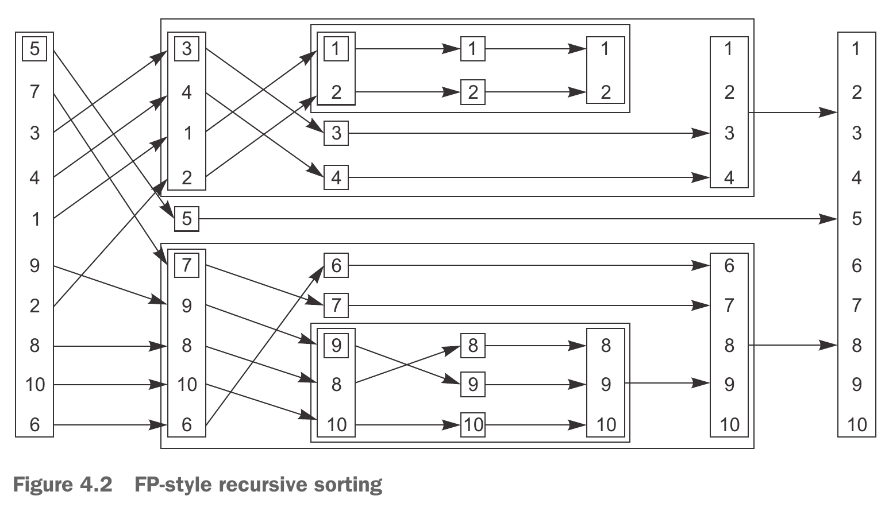
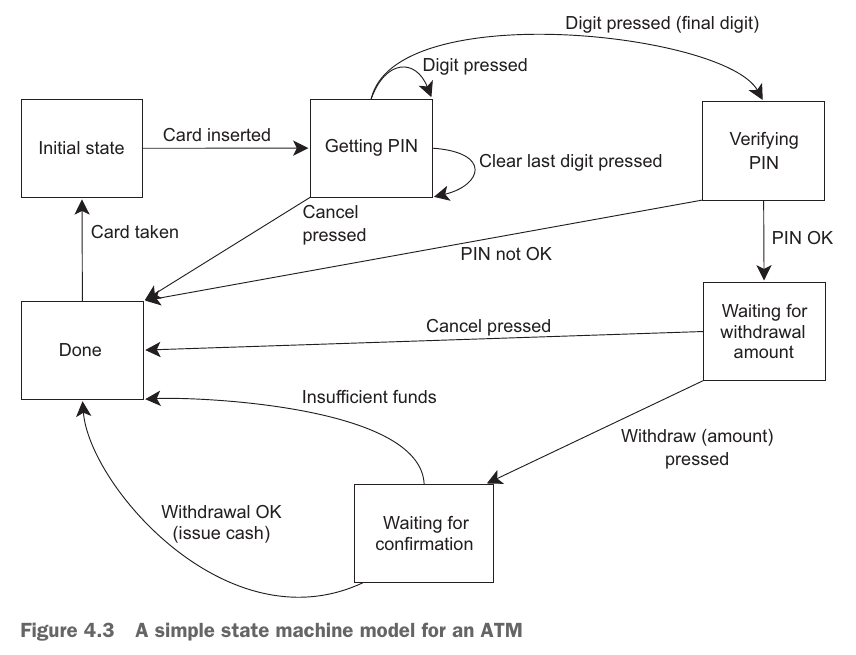

# Synchronizing Concurrent Operations

有时不仅需要保护数据，还需要**同步不同线程上的操作**。例如，一个线程可能需要等待另一个线程完成任务，然后才能开始完成自己的任务。通常，希望线程等待特定事件发生或条件成立是很常见的。虽然可以通过定期检查“任务完成”标志或存储在共享数据中的类似内容来实现这一点，但这并不是最佳的做法。像这样需要在线程之间同步操作的情况非常常见，C++ 标准库以 *条件变量 (condition variables)* 和 *futures* 的形式提供了处理该问题的工具。这些工具在并发技术规范 (Technical Specification, TS) 中进行了扩展，它为 futures 提供了更多操作，同时以 *latches* 和 *barriers* 的形式提供了新的同步工具。

# The Outline
- [Waiting for an event or other condition](#等待事件或其他条件)
    - [Waiting for a condition with condition variables](#使用条件变量等待条件)
    - [Building a thread-safe queue with condition variables](#使用条件变量构建线程安全队列)
- [Waiting for one-off events with futures](#使用-future-等待一次性事件)
    - [Returning values from background tasks](#从后台任务返回值)
    - [Associating a task with a future](#将任务与-future-关联)
    - [Making (std::)promises](#做出承诺stdpromise)
    - [Saving an exception for the future](#为-future-保存异常)
    - [Waiting from multiple threads](#从多个线程等待)
- [Waiting with a time limit](#有时间限制的等待)
    - [Clocks](#时钟)
    - [Durations](#持续时间)
    - [Time points](#时间点)
    - [Functions that accept timeouts](#接受超时的函数)
- [Using synchronization of operations to simplify code](#使用操作的同步来简化代码)
    - [Functional programming with futures](#使用-future-进行函数式编程)
    - [Synchronizing operations with message passing](#通过消息传递来同步操作)
    - [Continuation-style concurrency with the Concurrency TS](#使用并发-ts-实现延续式并发)
    - [Chaining continuations](#链接延续)
    - [Waiting for more than one future](#等待多个-future)
    - [Waiting for the first future in a set with when_any](#使用-when_any-等待集合中的第一个-future)
    - [Latches and barriers in the Concurrency TS](#锁存器-latch-和栅栏-barrier)
    - A basic latch type: `std::experimental::latch`
    - `std::experimental::barrier`: a basic barrier
    - `std::experimental::flex_barrier` — `std::experimental::barrier`’s flexible friend

## 等待事件或其他条件
当一个线程等待另一个线程完成某项任务时，有这几种选择：

**选择 1**：
等待线程持续地检查共享数据中的完成标志（被 mutex 保护着），被等待的那个线程完成任务后设置标志。但这种做法是一种浪费：该线程消耗了宝贵的处理器时间来反复检查标志，并且当互斥锁被等待线程锁定时，它就不能被任何其他线程锁定。

**选择 2**：
在等待线程检查标志后，如果标志没有被设置，就释放锁让线程睡眠一段时间。这样做比第一种做法有提升，在线程睡眠的时间段不占用 CPU 时间，但是睡眠的时长无法掌控。睡的时间太短，还是会浪费处理器时间去做检查标志的工作；睡的时间太长，响应被等待线程就有延迟。
```cpp
bool flag;
std::mutex m;
void wait_for_flag() {
    std::unique_lock<std::mutex> lk(m);
    while (!flag) {
        lk.unlock(); // 解锁
        std::this_thread::sleep_for(std::chrono::milliseconds(100)); // 睡100毫秒
        lk.lock(); // 接着上锁，检查标志
    }
}
```

**选择 3**：使用 C++ 标准库提供的**条件变量 (condition variables)**。从概念上讲，条件变量与事件或其他条件相关联，并且一个或多个线程可以等待该条件得到满足。当线程确定条件得到满足时，它可以通知一个或多个等待条件变量的线程，以唤醒它们并允许它们继续处理。

### 使用条件变量等待条件
C++ 标准库提供两种条件变量：`std::condition_variable` 和 `std::condition_variable_any`。它们都需要和 mutex 配套使用才能提供合适的同步功能：`std::condition_variable` 仅适用于 `std::unique_lock<std::mutex>`，目的是为了性能最大化；而 `std::condition_variable_any` 适用于所有满足 *BasicLockable* 要求的对象，更加灵活，同时开销也更大一些。

一个使用条件变量的例子（具体代码请见 [listing 4.1](../../src/ch04_synchronizing_concurrent_operations/listing_4_1.cc)）：
```cpp
std::mutex mtx;
std::queue<data_chunk> data_queue;  // 1
std::condition_variable data_cond;

void data_preparation_thread() {
    while (more_data_to_prepare()) {
        const data_chunk data = prepare_data();
        {
            std::lock_guard<std::mutex> lk(mtx);
            data_queue.push(data);  // 2
        }
        // 这行代码在锁之外，当等待线程被通知唤醒后，不必再去等待锁。
        // 如果将这行代码移动到锁的作用范围内，等待线程被通知唤醒后，还需要等待
        // 这个线程这边释放锁
        data_cond.notify_one();  // 3 通知一个等待线程
    }
}

void data_processing_thread() {
    while (true) {
        std::unique_lock<std::mutex> lk(mtx);  // 4
        // `wait()` 接受一个 `std::unique_lock` 类型参数 和 一个 `Predicate` 类型参数
        // 这里提供的 `Predicate` 是一个 lambda funciton
        //
        // wait 会检查 `Predicate` 是否成立（lambda 函数返回 true）：
        //   - 成立的话就返回
        //   - 不成立的话就解锁 mutex，让线程阻塞
        //
        // 当被另一个线程通过 条件变量 通知后，此线程被唤醒
        // 先尝试获取锁，接着检查条件是否成立：
        //   - 获取不到锁，阻塞
        //   - 获取了锁，条件也成立，就返回
        //   - 获取了锁，条件不成立，解锁接着阻塞
        data_cond.wait(lk, [] { return !data_queue.empty(); });  // 5
        data_chunk data = data_queue.front();
        data_queue.pop();
        lk.unlock();  // 6
        process(data);
        if (is_last_chunk(data)) {
            break;
        }
    }
}
```

从根本上讲，`std::condition_variable::wait` 是对 *忙等待* 的优化。事实上，符合要求（尽管不太理想）的实现技术只是一个简单的循环：
```cpp
template <typename Predicate>
void minimal_wait(std::unique_lock<std::mutex> &lk, Predicate pred) {
    while (!pred()) {
        lk.unlock();
        lk.lock();
    }
}
```

### 使用条件变量构建线程安全队列
`std::queue` 的接口：
```cpp
template <class T, class Container = std::deque<T> >
class queue {
public:
    explicit queue(const Container&);
    explicit queue(Container&& = Container());
    template <class Alloc> explicit queue(const Alloc&);
    template <class Alloc> queue(const Container&, const Alloc&);
    template <class Alloc> queue(Container&&, const Alloc&);
    template <class Alloc> queue(queue&&, const Alloc&);
    void swap(queue& q);
    bool empty() const;
    size_type size() const;
    T& front();
    const T& front() const;
    T& back();
    const T& back() const;
    void push(const T& x);
    void push(T&& x);
    void pop();
    template <class... Args> void emplace(Args&&... args);
};
```

需要实现的 `threadsafe_queue` 的接口：
```cpp
template<typename T>
class threadsafe_queue {
public:
    threadsafe_queue();
    threadsafe_queue(const threadsafe_queue &);
    threadsafe_queue& operator=(const threadsafe_queue &) = delete;
    void push(T new_value);
    bool try_pop(T& value);
    std::shared_ptr<T> try_pop();
    void wait_and_pop(T& value);
    std::shared_ptr<T> wait_and_pop();
    bool empty() const;
}
```

完整的实现代码请见 [listing 4.5](../../src/ch04_synchronizing_concurrent_operations/listing_4_5.hpp)。

## 使用 `future` 等待一次性事件
如果等待线程只等待一次，那么当条件为真时，它将永远不会再等待此条件变量，条件变量可能不是同步机制的最佳选择。如果等待的条件是特定数据的可用性，则尤其如此。在这种情况下，`future` 可能更合适。

C++ 标准库使用一种称为 `future` 的东西来建模这种一次性事件。如果线程需要等待特定的一次性事件，它会以某种方式获取代表该事件的 `future`。然后，线程可以定期在短时间内等待 `future`，以查看事件是否已发生，同时在检查之间执行其他任务。或者，它可以执行另一项任务，直到需要事件发生后才能继续，然后只需等待 `future` 准备就绪即可。

C++ 标准库提供两种 `future`s：`std::future<>` 和 `std::shared_future<>`。`std::future` 的实例是引用其关联事件的唯一实例，而 `std::shared_future` 的多个实例可能引用同一个事件。当事件发生后，`future` 实例准备就绪，可以通过它来获取与事件相关的数据。与事件相关的数据的类型也就是 `future` 的模板参数。在没有关联数据的地方应该使用 `std:future<void>` 和 `std::shared_future<void>` 模板特化。

```cpp
// defined in header <future>

template< class T > class future;      // (1) (since C++11)
template< class T > class future<T&>;  // (2) (since C++11)
template<> class future<void>;         // (3) (since C++11)

template< class T > class shared_future;      // (1) (since C++11)
template< class T > class shared_future<T&>;  // (2) (since C++11)
template<> class shared_future<void>;         // (3) (since C++11)
```

Concurrency TS 在 `std::experimental` 命名空间中提供了这些类模板的扩展版本： `std::experimental::future<>` 和 `std::experimental::shared_future<>`。它们的行为与 std 命名空间中的对应版本相同，但它们具有额外的成员函数来提供额外的功能。

### 从后台任务返回值
假设有一项耗时的计算任务，这个任务会返回一个期望的结果，但是现在并不着急需要这个结果。这种场景下，应该启动一个新线程来处理这项计算任务，等到结果就绪后或者主动需要结果时去获取这个结果。但是，`std::thread` 不能将结果传递给其他线程，这时候就需要 `std::async` 登场。

使用 `std::async` 启动异步任务后，不需要立即获得结果。`std::async` 不会给出一个 `std::thread` 对象让你等待，而是返回一个 `std::future` 对象，该对象最终将保存函数的返回值。当你需要该值时，只需在 `future` 对象上调用 `get()`，线程就会阻塞，直到 `future` 准备就绪，然后返回该值。

一个简单的使用 `std::async` 的例子（具体代码请见 [listing 4.6](../../src/ch04_synchronizing_concurrent_operations/listing_4_6.cc)）：
```cpp
int find_the_answer();
void do_other_stuff();

int main() {
    // the type of `ans` is: `std::future<int>`
    auto ans = std::async(find_the_answer);
    do_other_stuff();
    std::cout << "answer: " << ans.get() << std::endl;
}
```

与 `std::thread` 的构造函数类似，可以给 `std::async` 传递任务函数（不一定是函数，也可以是可调用的对象）的参数：
```cpp
struct X {
    void foo(int, const std::string &);
    std::string bar(const std::string &);
};
X x;
// 调用 p->foo(42, "hello")，这里的 p 是 &x
auto f1 = std::async(&X::foo, &x, 42, "hello");
// 调用 tmpx.bar("goodbye")，这里的 tmpx 是 x 的拷贝
auto f2 = std::async(&X::bar, x, "goodbye");

struct Y {
    double operator()(double);
};
Y y;
// 调用 tmpy(3.14)，这里的 tmpy 是从 Y() 移动构造的
auto f3 = std::async(Y(), 3.141);
// 调用 y(2.718)
auto f4 = std::async(std::ref(y), 2.718);

X baz(X &);
// 调用 baz(x)
std::async(baz, std::ref(x));

class move_only {
public:
    move_only();
    move_only(move_only&&)
    move_only(move_only const&) = delete;
    move_only& operator=(move_only&&);
    move_only& operator=(move_only const&) = delete;
    void operator()();
};
// 调用 tmp()，这里的 tmp 是从 std::move(move_only()) 构造的
auto f5 = std::async(move_only());
```

默认情况下，`std::async` 是否会启动一个新的线程是由实现决定的。但是，我们可以自己指定 `std::async` 的启动策略 (launch policy)。`std::async` 有一个重载版本：
```cpp
// since C++11, until C++17
template< class F, class... Args >
std::future<typename std::result_of<typename std::decay<F>::type(
        typename std::decay<Args>::type...)>::type>
    async( std::launch policy, F&& f, Args&&... args );
// since C++17
template< class F, class... Args >
std::future<std::invoke_result_t<std::decay_t<F>,
                                 std::decay_t<Args>...>>
    async( std::launch policy, F&& f, Args&&... args );
```
它的第一个参数 `policy` 是一个枚举类型 `std::launch`，有两个常量值：`std::launch::async` 和 `std::launch::deferred`。当 `policy` 指定为 `std::launch::async`，表示要执行的任务将在新的独立线程中执行；当 `policy` 指定为 `std::launch::deferred`，表示将要执行的任务推迟到在 `future` 上调用 `wait()` 或 `get()` 时执行，任务的执行跟调用 `wait()` 或 `get()` 在同一个线程。`std::launch` 是一个 [*BitmaskType*](https://en.cppreference.com/w/cpp/named_req/BitmaskType)，所以 `policy` 还可以指定为 `std::launch::async | std::launch::deferred`，表示由实现来选择以哪一种策略来启动。

```cpp
// tmpy(1.2) 在新线程中运行
auto f6 = std::async(std::launch::async, Y(), 1.2);
// baz(x) 在 f7.wait() 或 f7.get() 时调用
auto f7 = std::async(std::launch::deferred, baz, std::ref(x));
// 由实现选择
auto f8 = std::async(std::launch::async | std::launch::deferred, baz, std::ref(x));
auto f9 = std::async(baz, std::ref(x));
// 在此处才调用 baz(x)
f7.wait();
```

[demo 4.1](../../src/ch04_synchronizing_concurrent_operations/demo_4_1.cc) 可以测试 `policy` 设置为这几种值后的 `std::async` 的实际行为。
```cpp
std::string f() {
    std::ostringstream oss;
    oss << "thread " << std::this_thread::get_id();
    return oss.str();
}

int main() {
    std::cout << "main thread: " << std::this_thread::get_id() << std::endl;
    auto f1 = std::async(f);
    auto f2 = std::async(std::launch::async, f);
    auto f3 = std::async(std::launch::deferred, f);
    auto f4 = std::async(std::launch::async | std::launch::deferred, f);

    std::cout << "f1 runs in " << f1.get() << std::endl;
    std::cout << "f2 runs in " << f2.get() << std::endl;
    std::cout << "f3 runs in " << f3.get() << std::endl;
    std::cout << "f4 runs in " << f4.get() << std::endl;
}
```

我在 Ubutun 上使用 GCC 9.4.0 编译后执行的结果如下：
```
main thread: 140454396094272
f1 runs in thread 140454396090112
f2 runs in thread 140454387697408
f3 runs in thread 140454396094272
f4 runs in thread 140454379304704
```
我在 Windows11 上使用 Mingw-w64 gcc 14.1.0 编译后执行的结果如下：
```
main thread: 1
f1 runs in thread 2
f2 runs in thread 3
f3 runs in thread 1
f4 runs in thread 4
```

我在 Windows11 上使用 Microsoft Visual C++ 19.40.33812 编译后的结果如下：
```
main thread: 19560
f1 runs in thread 19584
f2 runs in thread 19584
f3 runs in thread 19560
f4 runs in thread 19584
```
可以看出，`policy` 设置为 `std::launch::deferred` 时指定的任务会推迟执行（并且跟主线程在一个线程中执行），而设置为其他值或不设置都会启动一个新线程去执行任务。

### 将任务与 `future` 关联
`std::packaged_task<>` 将 `future` 与函数或可调用对象绑定。当调用 `std::packaged_task<>` 对象时，它会调用关联的函数或可调用对象并使 `future` 准备就绪，并将返回值存储为关联数据。

`std::packaged_task<>` 的模板声明和构造函数如下所示：
```cpp
template< class R, class ...ArgTypes >
class packaged_task<R(ArgTypes...)>;

template< class F >
explicit packaged_task( F&& f );
```
它的模板参数是一个函数签名，当构造 `std::packaged_task` 的实例时，必须传入一个可以接受指定参数并返回可转换为指定返回类型的函数或可调用对象。类型并不需要精准匹配，因为可以隐式转换类型。例如：可以从一个接受 `int` 类型参数返回 `float` 类型的函数来构造一个 `std::packaged_task<double(double)>` 实例。

函数签名的返回类型标识从 `get_future()` 成员函数返回的 `std::future<>` 的类型，而函数签名的参数列表用于指定打包任务的函数调用操作符的签名。
```cpp
// Getting the result
std::future<R> get_future();
// Execution
void operator()( ArgTypes... args );
```

例如，我们可以写一个 `std::packaged_task` 的特化：
```cpp
// Listing 4.8 Partial class definition for a specialization of std::packaged_task< >
template <>
class packaged_task<std::string(std::vector<char> *, int)> {
public:
    template <typename Callable>
    explicit packaged_task(Callable &&f);

    std::future<std::string> get_future();

    void operator()(std::vector<char> *, int);
};
```

`std::packaged_task` 实例是一个可调用的对象，它可以被包装在一个 `std::function` 对象中，然后传递给 `std::thread` 作为线程函数，或者传递给另一个需要一个可调用对象的函数，或者直接被调用。当 `std::packaged_task` 作为函数对象调用时，传递给函数调用操作符的参数将传递给包含的函数，并且返回值作为异步结果存储在从 `get_future()` 获得的 `std::future` 中。

#### 在线程之间传递任务
```cpp
// Listing 4.9 Running code on a GUI thread using std::packaged_task
std::mutex m;
std::deque<std::packaged_task<void()>> tasks;
bool gui_shutdown_message_received();
void get_and_process_message();

void gui_thread() { // 1
    while (!gui_shutdown_message_received()) { // 2
        get_and_process_message(); // 3
        std::packaged_task<void()> task;
        {
            std::lock_guard<std::mutex> lk(m);
            if (tasks.empty()) { continue; } // 4
            task = std::move(tasks.front()); // 5 从队列中取出任务
            tasks.pop_front();
        }
        task(); // 6 执行任务
    }
}

template <typename Func>
std::future<void> post_task_for_gui_thread(Func f) {
    std::packaged_task<void()> task(f); // 7 创建任务
    std::future<void> res = task.get_future(); // 8 获取与任务相关的 future
    std::lock_guard<std::mutex> lk(m);
    tasks.push_back(std::move(task)); // 9 把任务放进队列
    return res; // 10 将 future 返回给发布任务者
}

std::thread gui_bg_thread(gui_thread);
```

### 做出承诺(std::promise)
`std::promise<T>` 提供了一种设置值（类型 `T`）的方法，该值稍后可以通过关联的 `std::future<T>` 对象读取。`std::promise/std::future` 对将为此功能提供一种可能的机制；等待线程可以在 `future` 上阻塞，而提供数据的线程可以使用与之配对的 `promise` 来设置关联值并使 `future` 准备就绪。

下面是一个处理网络连接的例子：数据包将从各个连接到来，并按照随机顺序进行处理，同样，数据包也会排队按随机顺序发送。
```cpp
// Listing 4.10 Handling multiple connections from a single thread using promises
void process_connections(connection_set &connections) {
    while (!done(connections)) { // 1 当 done() 返回 true 时结束循环
        for (
        connection_iterator connection = connections.begin(),
        end = connections.end(); connection != end; ++connection) {
            if (connection->has_incoming_data()) { // 3 检查是否有到来的数据
                // 获取到来的数据包
                data_packet data = connection->incoming();
                // 到来的包里面有 id 和 payload
                // id 会映射一个 promise
                std::promise<payload_type> &p = connection->get_promise(data.id);
                // 将 promise 的值设为包携带的 payload
                p.set_value(data.payload); // 4
            }
            if (connection->has_outgoing_data()) { // 5 检查是否有往外发送的数据
                // 获取往外发送的数据包
                outgoing_packet data = connection->top_of_outgoing_queue();
                // 发送数据包
                connection->send(data.payload);
                // 发送完成后，将与这个数据包相关的 promise 的值设为 true
                data.promise.set_value(true); // 6
            }
        }
    }
}
```

### 为 `future` 保存异常
如果 `std::async` 调用的函数抛出了异常，则该异常将存储在 `future` 引用的共享状态中以代替存储结果，然后 `future` 准备就绪，在 `future` 上调用 `get()` 将重新抛出该存储的异常。

```cpp
double square_root(doble x) {
    if (x < 0) {
        throw std::out_of_range("x < 0");
    }
    return sqrt(x);
}

std::future<double> f = std::async(square_root, -1);
double y = f.get(); // 重新抛出异常
```

同样，将一个函数包装在 `std::packaged_task` 中，若调用函数时抛出了异常，异常也会存储在 `std::future` 所引用的共享状态中，在 `std::future` 上调用 `get()` 时重新抛出存储的异常。

`std::promise` 也提供了同样的设施 —— `set_exception()` 来设置异常：
```cpp
extern std::promise<double> some_promise;
try {
    // 尝试设置值为 calculate_value() 返回的结果
    some_promise.set_value(calculate_value());
} catch (...) {
    // 如果 calculate_value() 抛出了异常
    // 通过 set_exception 来设置异常
    some_promise.set_exception(std::current_exception());
}

// 异常类型已知，直接设置某种异常
some_promise.set_exception(std::make_exception_ptr(std::logic_error("foo")));
```

还有一种存储异常的情况是在销毁 `std::promise` 对象 或 `std::packaged_task` 对象之前，没有在 `promise` 对象上调用 set 函数 (`set_value()` 或 `set_exception()` 等) 或者没有调用打包好的任务。具体的例子请见 [demo 4.2](../../src/ch04_synchronizing_concurrent_operations/demo_4_2.cc)。

### 从多个线程等待
如果从多个线程来访问单个 `std::future` 实例而不添加额外的同步，就会发生数据竞争和未定义的行为。原因是 `std::future` 对异步结果的所有权是独占的，`std::future::get()` 只能被调用一次，第一次调用才能获取异步结果，之后的调用都会产生未定义的行为。

如果需要多个线程等待同一个事件，C++ 标准库提供 `std::shared_future`。与 `std::future` 只能移动不同，`std::shared_future` 是可复制的。多个 `std::shared_future` 对象可以引用同一个关联状态。

首选的方法是将 `shared_future` 对象的副本传递给每个线程，这样每个线程都可以安全地访问自己的本地 `shared_future` 对象，因为内部现在已经由标准库正确同步。如果每个线程都通过自己的 `std::shared_future` 对象访问该状态，则从多个线程访问共享异步状态是安全的。


引用某些异步状态的 `std::shared_future` 实例可以由引用该状态的 `std::future` 实例构造：
```cpp
std::promise<int> p;
std::future<int> f(p.get_future());
assert(f.valid()); // f 是 valid，因为 f 引用了 p 的异步状态
std::shared_future<int> sf(std::move(f));  // 将 f 对异步状态的所有权转移给 sf
assert(!f.valid()); // f 不再是 valid
assert(sf.valid()); // sf 现在是 valid
```

像其他可移动的对象一样，对右值来说，所有权的转移是隐式发生的。所以，可以直接从 `get_future()` 的返回值构造 `std::shared_future` 对象：
```cpp
std::promise<std::string> p;
std::shared_future<std::string> sf(p.get_future());
```

`std::future` 还提供一个成员函数 `share()`，它可以返回一个 `std::shared_future` 对象并转移所有权，配合 `auto` 就能自动推导 `std::shared_future` 的模板参数的类型了：
```cpp
// 这个 promise 的模板参数类型很长...
std::promise<
    std::map< SomeIndexType, SomeDataType, SomeComparator, SomeAllocator>::iterator> p;
auto sf = p.get_future().share();
```

## 有时间限制的等待
前面介绍的阻塞调用都会等待一段不确定的时间（直到等待的事件就绪为止），其实，C++ 标准库还提供有时间限制的等待。标准库提供了两类超时 (timeout)：
- 基于持续时间的超时（*duration-based* timeout）：等待一个指定的时间段（例如，等待 30 毫秒）
- 绝对超时（*absolute* timeout）：等到特定的时间点（例如，等到 20:55:15.045987023 UTC on July 12, 2024）
绝大多数等待函数都提供两种变体，处理基于持续时间的超时的函数通常以 `_for` 结尾，处理绝对超时的函数通常以 `_until` 结尾。

### 时钟
C++ 标准库认为时钟是时间信息的来源。确切地说，时钟是提供四种不同信息的类：
- 当前时间
- 用于表示从时钟获取的时间的值的类型
- 时钟的滴答周期
- 时钟是否以均匀的速率流逝，是的话就被认为是一个稳定的时钟

时钟的当前时间可以通过时钟类的静态函数 `now()` 来获取。时钟的滴答周期以秒的小数形式指定，由时钟的类型成员 `period` 给出。如果一个时钟每秒滴答 25 次，则 `period` 是 `std::ratio<1,25>`；如果一个时钟每 2.5 秒滴答一次，则 `period` 是 `std::ratio<5,2>`。如果时钟以统一的速率滴答（无论该速率是否与周期匹配）并且无法调整，则该时钟被称为稳定时钟。如果时钟稳定，则时钟类的 `is_steady` 静态数据成员为 `true`，否则为 `false`。

C++ 11 标准库定义了 3 个时钟类：
- `system_clock`：系统范围的实时时钟
- `steady_clock`：永远不会被调整的单调时钟
- `high_resolution_clock`：具有最短可用滴答周期的时钟

### 持续时间
C++ 用类模板 `std::chrono::duration` 来代表一段持续时间：
```cpp
template<
    class Rep,
    class Period = std::ratio<1>
> class duration;
```
第一个模板参数称为 representation（类型可以是 `short`、`int`、`double` 等），它表示滴答的数量；第二个模板参数称为 period，它表示一个滴答周期（单位为秒）。例如，想要 `int` 类型来存储多少分钟，可以定义类型：`std::chrono::duration<int, std::ratio<60,1>>`；因为一分钟有 60 秒。C++ 标准库已经预定义了常用的时间单位：
| 类型 | 定义 |
| :-: | :-: |
| `std::chrono::nanoseconds`	      | `std::chrono::duration</* int64 */, std::nano>`           |
| `std::chrono::microseconds`	      | `std::chrono::duration</* int55 */, std::micro>`          |
| `std::chrono::milliseconds`	      | `std::chrono::duration</* int45 */, std::milli>`          |
| `std::chrono::seconds`	          | `std::chrono::duration</* int35 */>`                      |
| `std::chrono::minutes`	          | `std::chrono::duration</* int29 */, std::ratio<60>>`      |
| `std::chrono::hours`                | `std::chrono::duration</* int23 */, std::ratio<3600>>`    |
| `std::chrono::days (since C++20)`   | `std::chrono::duration</* int25 */, std::ratio<86400>>`   |
| `std::chrono::weeks (since C++20)`  | `std::chrono::duration</* int22 */, std::ratio<604800>>`  |
| `std::chrono::months (since C++20)` | `std::chrono::duration</* int20 */, std::ratio<2629746>>` |
| `std::chrono::years (since C++20)`  | `std::chrono::duration</* int17 */, std::ratio<31556952>>`|

为方便起见，`std::chrono_literals` 命名空间中预定义了一些用于持续时间的字面量后缀操作符（literal suffix operator）。这些操作符在 C++14 中引入，可以简化代码。
- `operator""h` (C++14): a `std::chrono::duration` literal representing hours (function)
- `operator""min` (C++14): a `std::chrono::duration` literal representing minutes (function)
- `operator""s` (C++14): a `std::chrono::duration` literal representing seconds (function)
- `operator""ms` (C++14): a `std::chrono::duration` literal representing milliseconds (function)
- `operator""us` (C++14): a `std::chrono::duration` literal representing microseconds (function)
- `operator""ns` (C++14): a `std::chrono::duration` literal representing nanoseconds (function)

使用示例：
```cpp
using namespace std::chrono_literals;
auto one_day = 24h;
auto half_an_hour = 30min;
auto max_time_between_messages = 30ms;
```

持续时间之间的转换是隐式的，不需要截断值（也就是说可以从分钟转换到秒，不能从秒转换到分钟），具体例子请见 [demo 4.3](../../src/ch04_synchronizing_concurrent_operations/demo_4_3.cc)。当不能隐式转换时，可以使用 `std::chrono::duration_cast` 来进行显式转换：
```cpp
std::chrono::milliseconds ms(54802);
std::chrono::seconds s = std::chrono::duration_cast<std::chrono::seconds>(ms);
```
`std::chrono::duration` 还支持算术运算。

基于持续时间的等待是通过 `std::chrono::duration<>` 的实例完成的。例如，可以等待最多 35 毫秒以等待 `future` 准备就绪：
```cpp
std::future<int> f = std::async(some_task);
if (f.wait_for(std::chrono::milliseconds(35)) == std::future_status::ready) {
    do_something_with(f.get());
}
```

这里的等待函数会返回状态，表示超时（`future_status::timeout`）、就绪（`future_status::ready`）或者任务被推迟（`future_status::deferred`）。基于持续时间的等待，所用的时钟是内部的稳定时钟。

### 时间点
时钟的时间点由 `std::chrono::time_point<>` 类模板的实例表示，该实例指定它所引用的时钟作为第一个模板参数，并指定测量单位（`std::chrono::duration<>` 的特化）作为第二个模板参数。
```cpp
template<
    class Clock,
    class Duration = typename Clock::duration
> class time_point;
```
时间点的值是自某个特定时间点（称为时钟纪元）以来的时间长度（以指定持续时间的倍数表示）。C++ 标准库并没有规定时钟纪元是什么时候，但是可以在 `time_point` 上调用 `time_since_epoch()` 函数来获取时钟从纪元到这个时间点的持续时间。
```cpp
auto tm1 = std::chrono::system_clock::now();
#if __cplusplus >= 202002L
std::cout << tm1.time_since_epoch() << std::endl;
#endif
```

可以从一个时间点加上或减去一个持续时间得到一个新的时间点；也可以将两个使用同一时钟的时间点相减得到一个持续时间（具体代码请见 [demo 4.4](../../src/ch04_synchronizing_concurrent_operations/demo_4_4.cc)）：
```cpp
auto tm1 = std::chrono::system_clock::now();
auto tm2 = tm1 + std::chrono::seconds(10);
auto tm3 = tm1 - std::chrono::minutes(2);
auto d1 = tm1 - tm3;
```

时间点与等待函数的 `_until` 变体一起使用。例如，如果你最多需要等待 500 毫秒才能等待与条件变量关联的事件，那么你可以执行以下清单中的操作：
```cpp
// Listing 4.11 Waiting for a condition variable with a timeout
#include <condition_variable>
#include <mutex>
#include <chrono>

std::condition_variable cv;
bool done;
std::mutex m;

bool wait_loop() {
    auto const timeout= std::chrono::steady_clock::now() +
        std::chrono::milliseconds(500);
    std::unique_lock<std::mutex> lk(m);
    while (!done) {
        if (cv.wait_until(lk,timeout) == std::cv_status::timeout) {
            break;
        }
    }
    return done;
}
```

### 接受超时的函数
| 类/命名空间 | 函数 | 返回值 |
| :-: | :-: | :-: |
| `std::this_thread` namespace | `sleep_for(duration)` <br> `sleep_until(time_point)` | N/A |
| `std::condition_variable` 或 `std::condition_variable_any` | `wait_for(lock, duration)` <br> `wait_for(lock, duration, predicate)` <br> `wait_until(lock, time_point)` <br> `wait_until(lock, time_point, predicate)` | `std::cv_status::timeout` 或 `std::cv_status::no_timeout` |
| `std::timed_mutex`, `std::recursive_timed_mutex` 或 `std::shared_timed_mutex` | `try_lock_for(duration)` <br> `try_lock_until(time_point)` | 成功获取锁返回 `true`，否则返回 `false` |
| `std::shared_timed_mutex` | `try_lock_shared_for(duration)` <br> `try_lock_shared_until(time_point)` | 如果成功获取共享锁所有权则为 `true`，否则为 `false` |
| `std::unique_lock<Mutex>`(`Mutex` meets the *TimedLockable* requirements) | `try_lock_for(duration)` <br> `try_lock_until(time_point)` | 如果成功获取互斥锁所有权则为 `true`，否则为 `false` |
| `std::shared_lock<Mutex>`(`Mutex` meets the *SharedTimedLockable* requirements) | `try_lock_for(duration)` <br> `try_lock_until(time_point)` | 如果成功获取共享锁所有权则为 `true`，否则为 `false` |
| `std::future` or `std::shared_future` | `wait_for(duration)` <br> `wait_until(time_point)` | `std::future_status::ready` 结果就绪 <br> `std::future_status::timeout` 超时 <br> `std::future_status::deferred` 共享状态中包含了惰性求值推迟函数，因此结果仅在明确要求时才会被计算 |

## 使用操作的同步来简化代码
使用本章前几节描述的同步设施作为构建块，可以让程序员专注于需要同步的操作而不是机制。这有助于简化代码，并支持一种更加功能化（在函数式编程的意义上）的并发编程。不是直接在线程之间共享数据，而是可以为每个任务提供所需的数据，然后通过使用 `future` 将结果传播给任何其他需要它的线程。

### 使用 `future` 进行函数式编程
[*函数式编程 (functional programming, FP)*](https://en.wikipedia.org/wiki/Functional_programming) 指的是一种编程风格，其中函数调用的结果仅取决于该函数的参数，而不依赖于任何外部状态。也就是说，当用同样的参数调用一个函数两次，得到的结果是确切相同的。*[纯函数 (pure function)](https://en.wikipedia.org/wiki/Pure_function)* 也不会修改任何外部状态；函数的效果完全限于返回值。这使得事情变得容易起来，特别是在并发的情况下，因为许多与共享数据相关的问题消失了。如果共享数据没有被修改，就不会出现竞争条件，因此也不需要用互斥锁来保护共享数据。

#### 函数式编程风格的快速排序
快速排序的流程：


串行快速排序示例代码（具体代码请见 [listing 4.12](../../src/ch04_synchronizing_concurrent_operations/listing_4_12.cc)）：
```cpp
// Listing 4.12 A sequential implementation of Quicksort
template <typename T>
std::list<T> sequential_quicksort(std::list<T> input) {
    if (input.empty()) {
        return input;
    }
    std::list<T> result; // 创建一个空的 list 存储排序后的结果
    // 选取 input 的第一个元素作为枢轴元素，移动到 result 的开头
    result.splice(result.begin(), input, input.begin()); // 1
    // 引用枢轴元素
    const T &pivot = *result.begin();            // 2
    // 将 input 中 小于枢轴元素的所有元素 重新排到 大于或等于枢轴元素的所有元素 的前面
    // 返回值是指向第一个不小于枢轴元素的迭代器
    auto divide_point = std::partition(input.begin(), input.end(),
                                       [&](const T &t) { return t < pivot; }); // 3
    std::list<T> lower_part; // 创建一个空的 list 存储小于枢轴元素的所有元素
    // 将 input 中小于枢轴元素的所有元素移动到 lower_part 中（从 lower_part 的后面开始添加）
    // 完成后，input 中只剩下大于或等于枢轴元素的元素了
    lower_part.splice(lower_part.end(), input, input.begin(), divide_point); // 4
    // 将小于枢轴的所有元素排序
    auto new_lower(sequential_quicksort(std::move(lower_part))); // 5
    // 将大于或等于枢轴的所有元素排序
    auto new_higher(sequential_quicksort(std::move(input))); // 6
    // 将已经有序的所有大于或等于枢轴的元素移动到 result 中（从 result 的后面开始添加）
    result.splice(result.end(), new_higher); // 7
    // 将已经有序的所有小于枢轴的元素移动到 result 中（从 result 的前面开始添加）
    result.splice(result.begin(), new_lower); // 8
    // 最后 result 保存了 input 的有序结果
    return result;
}
```

#### 函数式编程风格的并行快速排序
串行快速排序示例代码（具体代码请见 [listing 4.13](../../src/ch04_synchronizing_concurrent_operations/listing_4_13.cc)）：
```cpp
template <typename T>
std::list<T> parallel_quicksort(std::list<T> input) {
    if (input.empty()) {
        return input;
    }
    std::list<T> result;
    result.splice(result.begin(), input, input.begin());
    const T &pivot = *result.begin();
    auto divide_point = std::partition(input.begin(), input.end(),
                                       [&](const T &t) { return t < pivot; });
    std::list<T> lower_part;
    lower_part.splice(lower_part.end(), input, input.begin(), divide_point);
    std::future<std::list<T>> new_lower(
        std::async(&parallel_quicksort<T>, std::move(lower_part))
    ); // 1
    auto new_higher(parallel_quicksort(std::move(input))); // 2
    result.splice(result.end(), new_higher); // 3
    result.splice(result.begin(), new_lower.get()); // 4
    return result;
}
```

除了使用 `std::async()`，你还可以编写自己的 `spawn_task()` 函数作为 `std::packaged_task` 和 `std::thread` 的简单包装器，如清单 4.14 所示；你可以为函数调用的结果创建一个 `std::packaged_task`，从中获取 `future`，在线程上运行它，并返回 `future`。

```cpp
// Listing 4.14 A sample implementation of spawn_task
template <typename F, typename A>
std::future<std::result_of<F(A &&)>::type> spwan_task(F &&f, A &&a) {
    typedef std::result_of<F(A &&)>::type result_type;
    std::packaged_task<result_type(A &&)> task(std::move(f));
    std::future<result_type> res(task.get_future());
    std::thread t(std::move(f), std::move(a));
    t.detach();
    return res;
}
```

### 通过消息传递来同步操作
除了函数式编程这种范式外，另一个并发编程范式是通信顺序进程 (communicating sequential processes, CSP)。在 CSP 这种范式下：线程在概念上是完全独立的，没有共享数据，但允许有通信通道在它们之间传递消息。每个线程都可以完全独立地推理，完全基于它对收到的消息做出的响应。因此，每个线程实际上都是一个状态机（state machine）：当它收到一条消息时，它会以某种方式更新其状态，并可能向其他线程发送一条或多条消息，处理过程取决于初始状态。编写此类线程的一种方法是将其形式化并实现 *有限状态机*（[finite state machine](https://en.wikipedia.org/wiki/Finite-state_machine)）模型，但这不是唯一的方法；状态机可以隐式存在于应用程序的结构中。

真正的通信顺序进程没有共享数据，所有通信都通过消息队列传递，但由于 C++ 线程共享地址空间，因此无法强制执行此要求。程序员有责任确保线程之间不共享数据。当然，线程之间必须共享消息队列才能进行通信，但细节可以封装在库中。

看一个实现 ATM 系统的例子：一个 ATM 系统需要处理与用户的交互、与银行的交互、以及控制物理器件接收卡片、显示信息、处理按键、吐出钱币、退回卡片等操作。一种方式是将这个系统分割成三个独立的线程：处理物理器件的线程、处理 ATM 逻辑的线程和与银行通信的线程；这些线程仅仅通过传递消息来沟通，而不共享数据。然后，对这个系统建立状态机模型。

ATM 逻辑部分的状态机模型如下图所示：


可以用一个类来实现 ATM 逻辑部分的状态机，用成员函数来表示每一个状态。每一个成员函数等待接收一个特定的消息集合，当消息到来时进行处理；根据到来的消息，可能会转到另一个状态。每一个消息的类型用一个单独的 `struct` 来表示。下面是一个简单的代码实现：
```cpp
// Listing 4.15 A simple implementation of an ATM logic class
struct card_inserted {
    std::string account;
};

class atm {
    messaging::receiver incoming;
    messaging::sender bank;
    messaging::sender interface_hardware;
    void (atm::*state)(); // 成员函数指针
    std::string account;
    std::string pin;

    void waiting_for_card() { // 1 "waiting for card" 状态函数
        // 发送 “显示等待接收卡片” 的消息给硬件接口（即物理器件接口）
        interface_hardware.send(display_enter_card()); // 2
        incoming.wait() // 3 等待消息到来
            .handle<card_inserted>(
                [&] (const card_inserted &msg) { // 4 这个状态下只有这一种消息需要处理
                    account = msg.account; // 获取账号
                    pin = ""; // 将 pin 清空
                    // 发送 “显示等待pin” 的消息给硬件接口
                    interface_hardware.send(display_enter_pin());
                    // 转到下一个状态
                    state = &atm::getting_pin;
                }
            )
    }

    void getting_pin();
public:
    void run() { // 5 从这里开始执行
        state = &atm::waiting_for_card(); // 6 将初始状态设为 "waiting for card"
        try {
            // 反复执行表示当前状态的成员函数
            for (;;) {
                (this->*state)(); // 7
            }
        } catch (const messaging::close_queue &e) {
            // ...
        }
    }
};
```

通过上面的代码可以看出，我们无需考虑同步和并发问题，只需考虑在任意给定点可以接收哪些消息以及发送哪些消息。此 ATM 逻辑的状态机在单个线程上运行，而系统的其他部分（例如银行接口和终端接口）则在单独的线程上运行。这种程序设计风格称为 [Actor 模型](https://en.wikipedia.org/wiki/Actor_model) - 系统中有多个离散的参与者（每个参与者都在单独的线程上运行），它们互相发送消息来执行手头的任务，除了直接通过消息传递的状态外，没有共享状态。

`getting_pin()` 状态函数的实现代码：
```cpp
// Listing 4.16 The getting_pin state function for the simple ATM implementation
void atm::getting_pin() {
    incoming.wait()
        .handle<digit_pressed>( // 1
            [&] (const digit_pressed &msg) {
                const unsigned pin_length = 6;
                pin += msg.digit;
                if (pin.length() == pin_length) {
                    bank.send(verify_pin(account, pin, incoming));
                    state = &atm::verifying_pin;
                }
            }
        )
        .handle<clear_last_pressed>( // 2
            [&] (const clear_last_pressed &msg) {
                if (!pin.empty()) {
                    pin.resize(pin.length() - 1);
                }
            }
        )
        .handle<cancel_pressed>( // 3
            [&] (const cancel_pressed &msg) {
                state = &atm::done_processing;
            }
        );
}
```

如你所见，这种编程风格可以大大简化设计并发系统的任务，因为每个线程都可以完全独立处理。这是一个使用多个线程来分离关注点的示例，因此需要明确决定如何在线程之间划分任务。

### 使用并发 TS 实现延续式并发
Concurrency TS 在 `std::experimental` 命名空间中提供了 `std::promise` 和 `std::packaged_task` 的新版本，它们都与 std 原始版本有一点不同：它们返回 `std::experimental::future` 的实例，而不是 `std::future`。这使用户能够利用 `std::experimental::future` 中的关键新功能 —— *延续（continuation）*。

延续的意思是：当数据就绪，然后就能进行处理。将延续添加到 `future` 的成员函数称为 `then()`。给定一个 `future`: `fut`，使用调用 `fut.then(continuation)` 添加延续。就像 `std::future` 一样，`std::experimental::future` 只允许检索一次存储的值。如果该值正在被延续使用，则意味着其他代码无法访问它。因此，当使用 `fut.then()` 添加延续时，原始 future `fut` 将变为无效。相反，对 `fut.then()` 的调用将返回一个新的 future 来保存延续调用的结果。
```cpp
std::experimental::future<int> find_the_answer();
auto fut = find_the_answer();
auto fut2 = fut.then(find_the_question);
assert(!fut.valid());
assert(fut2.valid());
```

我们不能将参数传递给延续函数，因为参数已经由库定义了 - 延续传递了一个已准备好的 `future`，其中包含触发延续的结果。上面例子中的 `find_the_question` 函数只能接收类型为 `std::experimental::future<int>` 的单个参数。

可以通过并发 TS 来实现 `std::async`。使用 `std::experimental::promise` 来获取 `future`，然后生成一个运行 lambda 的新线程，将 `promise` 的值设置为所提供函数的返回值：
```cpp
// Listing 4.17 A simple equivalent to std::async for Concurrency TS futures
template <typename Func>
std::experimental::future<decltype(std::declval<Func>()())>
spawn_async(Func &&func) {
    std::experimental::promise<decltype(std::declval<Func>()())> p;
    auto res = p.get_future();
    std::thread t(
        [p = std::move(p), f = std::decay_t<Func>(func)] () mutable {
            try {
                p.set_value_at_thread_exit(f());
            } catch (...) {
                p.set_exception_at_thread_exit(std::current_exception());
            }
        }
    );
    t.detach();
    return res;
}
```

### 链接延续
假设你有一系列耗时的任务要执行，并且你希望异步执行这些任务，以便释放主线程来执行其他任务。例如，当用户登录到你的应用程序时，你可能需要将凭据发送到后端进行身份验证；然后，在详细信息通过身份验证后，向后端发出进一步的请求以获取有关用户帐户的信息；最后，在检索到该信息后，使用相关信息更新显示。

串行的代码示例如下：
```cpp
// Listing 4.18 A simple sequential function to process user login
void process_login(const std::string &username, const std::string &password) {
    try {
        const user_id id = backend.authenticate_user(username, password);
        const user_data info_to_display = backend.request_current_info(id);
        update_display(info_to_display);
    } catch (std::exception &e) {
        display_error(e);
    }
}
```

使用普通的 `std::async`，可以将所有内容都放到后台线程中，但这仍然会阻塞该线程，并在等待任务完成时消耗资源。
```cpp
// Listing 4.19 Processing user login with a single async task
std::future<void> process_login(const std::string &username, const std::string &password) {
    return std::async(std::launch::async, [=] () {
        try {
            const user_id id = backend.authenticate_user(username, password);
            const user_data info_to_display = backend.request_current_info(id);
            update_display(info_to_display);
        } catch (std::exception &e) {
            display_error(e);
        }
    });
}
```

为了避免所有这些线程被阻塞，你需要某种机制来在任务完成时将它们链接起来：延续。下面的清单显示了相同的总体流程，但这次将其分成一系列任务，每个任务都作为延续链接到前一个任务上。
```cpp
// Listing 4.20 A function to process user login with continuations
std::experimental::future<void> process_login(
const std::string &username, const std::string &password) {
    return spawn_async([=] () {
        return backend.authenticate_user(username, password);
    }).then([] (std::experimental::future<user_id> id) {
        return backend.request_current_info(id.get());
    }).then([] (std::experimental::future<user_data> info_to_display) {
        try {
            update_display(info_to_display.get());
        } catch (std::exception &e) {
            display_error(e);
        }
    });
}   
```

即使将任务拆分为各个部分，但它们仍会阻塞调用，因此线程阻塞的情况依然存在。现在需要的是：在数据准备就绪时，后端调用返回就绪的 `future`，而不会阻塞任何线程。在这种情况下，`backend.async_authenticate_user(username, password)` 现在将返回 `std::experimental::future<user_id>`，而不是普通的 `user_id`。
```cpp
// Listing 4.21 A function to process user login with fully asynchronous operations
std::experimental::future<void> process_login(
const std::string &username, const std::string &password) {
    return backend.async_authenticate_user(username, password).then(
    [] (std::experimental::future<user_id> id) {
        return backend.async_request_current_info(id.get());
    }).then([] (std::experimental::future<user_data> info_to_display) {
        try {
            update_display(info_to_display.get());
        } catch (std::exception &e) {
            display_error(e);
        }
    });
}
```


### 等待多个 future
如果需要等待多个任务完成后、收集这些任务产生的结果、并进行下一步处理，使用 `std::async` 来实现的代码如下所示：
```cpp
// Listing 4.22 Gathering results from futures using std::async
std::future<ChunkResult> process_data(std::vector<MyData> &vec) {
    const size_t chunk_size = whatever;
    std::vector<std::future<ChunkResult>> results;
    for (auto beg = vec.begin(), end = vec.end(); beg != end;) {
        const size_t remaining_size = end - beg;
        const size_t this_chunk_size = std::min(remaining_size, chunk_size);
        results.push_back(std::async(process_chunk, beg, beg + this_chunk_size));
        beg += this_chunk_size;
    }
    return std::async([all_results = std::move(results)] {
        std::vector<ChunkResult> v;
        v.reserse(all_results.size());
        for (auto &f : all_results) {
            v.push_back(f.get()); // 1
        }
        return gather_results(v);
    });
}
```

由于上面的代码会单独等待每个任务，因此当每个结果可用时，在 1 处的会被调度程序反复唤醒，然后当它发现另一个尚未准备好的结果时再次返回休眠状态。这不仅占用了等待的线程，而且在每个 `future` 准备就绪时增加了额外的上下文切换，从而增加了额外的开销。使用 `std::experimental::when_all` 可以避免切换和等待：
```cpp
// Listing 4.23 Gathering results from futures using std::experimental::when_all
std::experimental::future<ChunkResult> process_data(std::vector<MyData> &vec) {
    const size_t chunk_size = whatever;
    std::vector<std::experimental::future<ChunkResult>> results;
    for (auto beg = vec.begin(), end = vec.end(); beg != end;) {
        const size_t remaining_size = end - beg;
        const size_t this_chunk_size = std::min(remaining_size, chunk_size);
        results.push_back(spawn_async(process_chunk, beg, beg + this_chunk_size));
        beg += this_chunk_size;
    }
    return std::experimental::when_all(results.begin(), results.end()) // 1
        .then([] (std::future<std::vector<std::experimental::future<ChunkResult>>> ready_results) {
            std::vector<std::experimental::future<ChunkResult>> all_results = ready_results.get();
            std::vector<ChunkResult> v;
            v.reserse(all_results.size());
            for (auto &f : all_results) {
                v.push_back(f.get()); // 2
            }
            return gather_results(v);
        });
}
```

### 使用 `when_any` 等待集合中的第一个 `future`
假设有多个任务组成的集合，当第一个完成的任务将结果准备好后，就能进行接下来的任务了；这中情况下， 可以使用 `std::experimental::when_any`。在这里，`std::experimental::when_any` 将 `future`们 集合在一起，并提供一个新的 `future`，当原始集合中至少有一个准备好时，该 `future` 即可准备好。虽然 `when_all` 为您提供了一个包装您传入的 `future` 集合的 `future`，但 `when_any` 增加了另一个层，将集合与一个索引值组合在一起，该索引值指示哪个 `future` 触发了组合 `future` 准备就绪，并将其放入 `std::experimental::when_any_result` 类模板的实例中。

一个使用 `when_any` 的例子：
```cpp
// Listing 4.24 Using std::experimental::when_any to process the first value found
std::experimental::future<FinalResult>
find_and_process_value(std::vector<MyData> &data) {
    const unsigned concurrency = std::thread::hardware_concurrency();
    const unsigned num_tasks = (concurrency > 0) ? concurrency : 2;
    std::vector<std::experimental::future<MyData *>> results;
    const auto chunk_size = (data.size() + num_tasks - 1) / num_tasks;
    auto chunk_begin = data.begin();
    std::shared_ptr<std::atomic<bool>> done_flag = std::make_shared<std::atomic<bool>>(false);
    for (unsigned i = 0; i < num_tasks; ++i) { // 1
        auto chunk_end = (i < num_tasks - 1) ? chunk_begin + chunk_size : data.end();
        results.push_back(spawn_async([=] { // 2
            for (auto entry = chunk_begin; !*done_flag && entry != chunk_end; ++entry) {
                if (matches_find_criteria(*entry)) {
                    *done_flag = true;
                    return &*entry;
                }
            }
            return (MyData *)nullptr;
        }));
        chunk_begin = chunk_end;
    }

    std::shared_ptr<std::experimental::promise<FinalResult>> final_result = 
        std::make_shared<std::experimental::promise<FinalResult>>();
    
    struct DoneCheck {
        std::shared_ptr<std::experimental::promise<FinalResult>> final_result;
        
        DoneCheck(std::shared_ptr<std::experimental::promise<FinalResult>> final_result_)
            : final_result(std::move(final_result_)) {}
        
        void operator()( // 4
            std::experimental::future<std::experimental::when_any_result<
                std::vector<std::experimental::future<MyData *>>>> results_param
        ) {
            auto results = results_param.get();
            const MyData *ready_result = results.futures[results.index].get(); // 5
            if (ready_result) {
                final_result->set_value(process_found_value(*ready_result)); // 6
            } else {
                results.futures.erase(results.futures.begin() + results.index); // 7
                if (!results.futures.empty()) {
                    std::experimental::when_any(results.futures.begin(), results.futures.end()) // 8
                        .then(std::move(*this));
                } else {
                    final_result->set_exception(
                        std::make_exception_ptr(std::runtime_error("Not found"))); // 9
                }
            }
        }
    }

    std::experimental::when_any(results.begin(), results.end())
        .then(DoneCheck(final_result)); // 3
    return final_result->get_future(); // 10
}
```

### 锁存器 (latch) 和栅栏 (barrier)
Latch（锁存器/线程闩）是一种同步对象，当其计数器递减为零时，该对象将变为就绪状态。Latch 的名称源于其锁存输出的事实，一旦就绪，它就会一直保持就绪状态，直到被销毁。因此，latch 是一种用于等待一系列事件发生的轻量级工具。

Barrier（屏障/栅栏/线程卡）是一种可重复使用的同步组件，用于一组线程之间的内部同步。Latch 并不关心哪些线程会减少计数器（同一个线程可以多次减少计数器，或者多个线程可以各自减少计数器一次，或者两者结合），而使用 barrier 时，每个线程每个周期只能到达 barrier 一次。当线程到达 barrier 时，它们会阻塞，直到所有相关线程都到达屏障，此时它们都会被释放。可以重复使用 barrier - 然后线程可以再次到达 barrier，等待所有线程进入下一个周期。

Latch 和 barrier 是在 Concurrency TS 中提出的，现在已经进入 C++ 20 标准库了。

